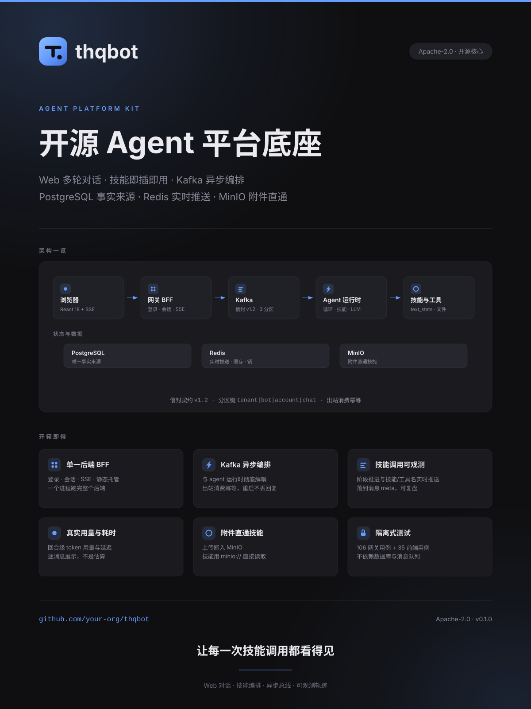
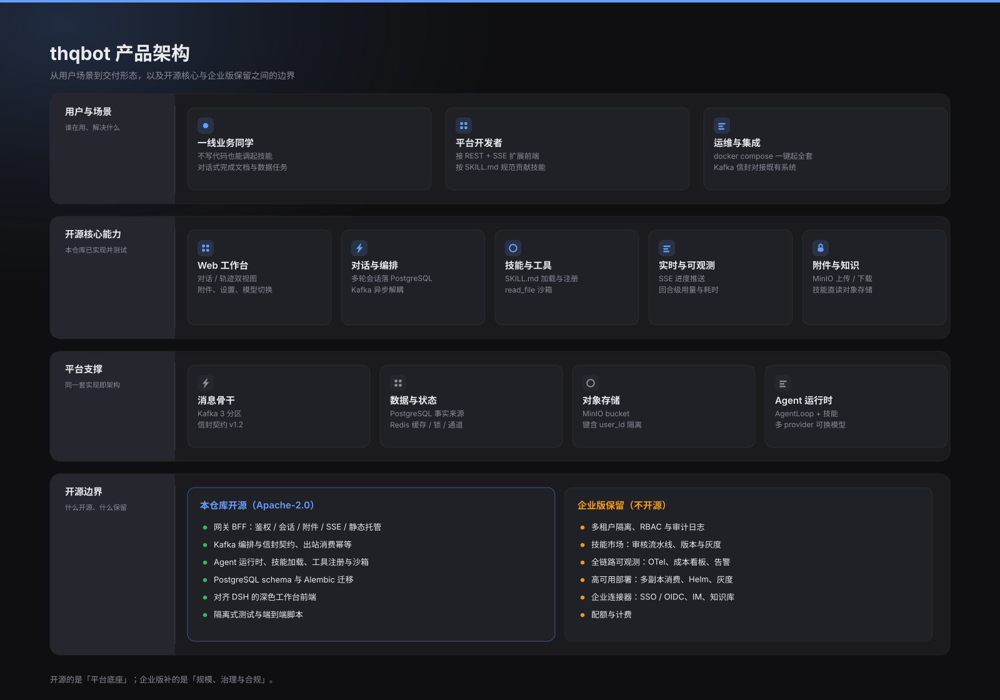
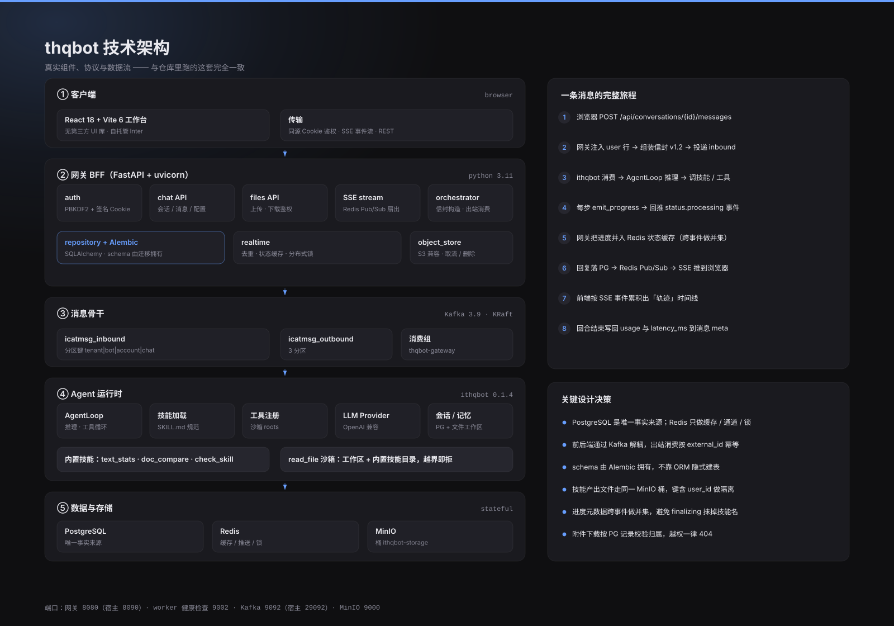
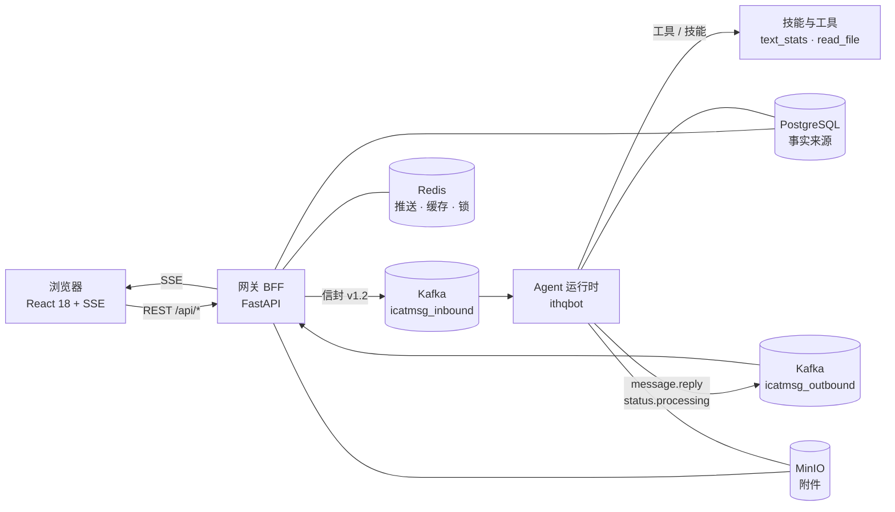

<p align="center">
  
</p>

<h3 align="center">开源 Agent 平台底座</h3>

<p align="center">
  把多轮对话、技能编排与异步消息总线，装进一个<b>能跑起来</b>的仓库
</p>

<p align="center">
  <a href="LICENSE"></a>
  <a href="#快速开始"></a>
  <a href="#技术栈"></a>
  <a href="#技术栈"></a>
  <a href="#技术栈"></a>
  <a href="#测试与验证"></a>
  <a href="#开源边界"></a>
</p>

<p align="center">
  <a href="#快速开始"><b>快速开始</b></a> ·
  <a href="#架构">架构</a> ·
  <a href="#演示">演示</a> ·
  <a href="#开源边界">开源边界</a> ·
  <a href="docs/ARCHITECTURE.md">设计文档</a> ·
  <a href="docs/ENGINEERING.md">工程细节</a>
</p>

<p align="center">
  
</p>

---

## 这是什么

**thqbot** 是一个可直接运行的开源 Agent 平台底座：一个 Web 工作台 + 一个异步消息骨干 + 一个 agent 运行时，把「用户发一句话」到「技能被执行、过程被看见、结果被落库」的完整链路跑通。

它不是 demo 拼盘，也不是框架封装 —— 仓库里的这套就是我们在用的那套，`docker compose up` 之后立刻可用。

<table>
<tr><td width="50%" valign="top">

**看得见**
技能调用不是黑盒：阶段推进、调用了哪个技能/工具，实时推给前端，并落到消息的 `meta` 里可复盘；回合级 token 用量与耗时同样真实写回。

</td><td width="50%" valign="top">

**拆得开**
前后端通过 Kafka 解耦（信封契约 v1.2，分区键 `tenant|bot|account|chat`），网关重启期间 agent 的回复不会丢；出站消费按 `external_id` 幂等。

</td></tr>
<tr><td valign="top">

**接得住**
PostgreSQL 是唯一事实来源，schema 由 Alembic 拥有；Redis 只承担缓存、推送与锁；附件走 MinIO，技能用 `minio://` 直接读，不用来回拷贝。

</td><td valign="top">

**验得过**
141 个用例全部本地可跑：网关 106 个（临时 SQLite + 内存 Redis，不依赖任何外部服务）、前端 35 个（Markdown 解析 + 组件真实 SSR 渲染，不需要浏览器）。

</td></tr>
</table>

## 为什么值得一看

| 差异点 | 说明 |
|---|---|
| **技能调用全过程可观测** | 进度元数据带一等字段 `_tool_name` / `_skill_name` / `_call_type`；网关把它们**跨事件做并集**累计，避免最后那个 `finalizing` 事件把技能名抹掉，最终落到消息 `meta.progress` 并实时 SSE 推送 |
| **真实用量，不是估算** | 运行时按回合累计 prompt/completion tokens 与调用次数，网关把 `usage` + `latency_ms` 写进消息 meta，前端逐条消息展示（`↑17.1k ↓185 · 2 次调用 · 35s`） |
| **附件直通技能** | 上传即入 MinIO，对象键含 `user_id` 做隔离；技能通过 `minio://<bucket>/<key>` 直接读取，doc_compare 这类技能零拷贝 |
| **下载授权按记录校验** | `GET /api/files/{id}` 先按 `user_id + file_id` 查 PG 记录再取流，**不使用路径前缀这类弱校验**，越权一律 404 |
| **修了 6 个上游阻断性缺陷** | 包括「所有工具/技能执行都抛 NameError」「渲染出的配置被静默忽略」「httpx 无法解析 NO_PROXY 里的 `[::1]` 导致所有 LLM 调用失败」等，每条都补了测试 |
| **前端对齐 DeepSeek Harness** | 748px 居中阅读列、16/28 正文、12/20 元信息、`cubic-bezier(0.4,0,0.2,1)` 动效曲线，以及「对话 / 轨迹」双视图 |

## 架构

<p align="center">
  
</p>

<p align="center"><sub>产品架构：用户场景 → 开源核心能力 → 平台支撑 → 开源边界</sub></p>

<p align="center">
  
</p>

<p align="center"><sub>技术架构：真实组件、协议，以及一条消息的完整旅程</sub></p>



完整设计说明（信封契约、数据流编号、关键取舍）见 **[docs/ARCHITECTURE.md](docs/ARCHITECTURE.md)**。

## 快速开始

### 方式一：一条命令起全套（推荐）

```bash
git clone https://github.com/your-org/thqbot.git
cd thqbot

# 1. 配置 LLM（任何 OpenAI 兼容端点都可以）
cp .env.example .env
#    编辑 .env，至少填这三项：
#    APP_LLM_BASE_URL=https://api.deepseek.com
#    APP_LLM_API_KEY=sk-...
#    APP_LLM_MODEL=deepseek-chat

# 2. 起全套（PostgreSQL / Kafka / MinIO / 网关 / agent worker）
docker compose up -d --build
```

打开 <http://127.0.0.1:8090>，默认账号 **admin / admin123456**。

> 只有 Redis 需要你自己准备：`docker run -d -p 6379:6379 --name redis redis:7-alpine`
> （编排文件刻意不托管 Redis，方便对接你已有的实例。）

### 方式二：本机调试（业务进程跑在容器外）

```powershell
docker compose up -d postgres kafka kafka-init minio
python -m venv .venv ; .\.venv\Scripts\pip install -r services\gateway\requirements.txt
.\scripts\dev-local.ps1 -Target render     # 渲染 ithqbot 配置
.\scripts\dev-local.ps1 -Target gateway    # 一个终端：网关 :8090
.\scripts\dev-local.ps1 -Target worker     # 另一个终端：agent worker
```

### 端到端自检

```bash
python scripts/e2e_chat.py --message "用 text_stats 工具统计：你好世界"
python scripts/verify_attachment.py        # 附件往返 + 越权拒绝
```

## 演示

| # | 提示词 | 预期 |
|---|--------|------|
| 1 | `用 text_stats 工具统计这句话：thqbot 是一个 agent 平台，支持多轮对话与技能调用。` | 返回真实统计结果；`meta.progress.skills == ["text_stats"]` |
| 2 | `请用 check_skill 工具检查 text_stats 这个技能是否符合 SKILL_STANDARDS 标准` | 返回 PASS/WARN 合规报告 |
| 3 | `请用 read_file 读取 text_stats 技能的 SKILL.md，并说明它具备什么能力` | 准确复述 SKILL.md；`progress.tools == ["read_file"]` |
| 4 | 上传 `spec-v1.md` 与 `spec-v2.md` 两个附件，然后问 `请对比这两份文档的差异` | 技能**直接从 MinIO 读取**两份文档并输出逐点差异 |

顶部功能胶囊（`text_stats` / `doc_compare` / `check_skill` / `read_file` / `otp`）点一下就能把对应提示词填进输入框。

## 技术栈

| 层 | 选型 | 说明 |
|---|---|---|
| 前端 | React 18 + Vite 6 + TypeScript | **不引第三方 UI / Markdown / 图标库**；自研 Markdown 解析器输出结构化数据，全程不用 `innerHTML` |
| 网关 | FastAPI + uvicorn + SQLAlchemy + Alembic | 单应用后端：鉴权、会话、附件、SSE、静态托管 |
| 消息 | Apache Kafka 3.9（KRaft） | `icatmsg_inbound` / `icatmsg_outbound` 各 3 分区 |
| 存储 | PostgreSQL 16 / Redis 7 / MinIO | 事实来源 / 推送·缓存·锁 / 对象存储 |
| Agent | ithqbot runtime | AgentLoop、技能加载（`SKILL.md` 规范）、工具注册、多 provider |
| 可观测 | 进度元数据 + SSE | 阶段、技能、工具、token 用量、耗时 |

## 开源边界

这是一个 **open core** 项目：平台底座整套开源，规模化与治理能力保留。

| 能力 | 本仓库（Apache-2.0） | 企业版（保留） |
|---|---|---|
| 网关 BFF（鉴权 / 会话 / 附件 / SSE / 静态托管） | ✅ | — |
| Kafka 编排、信封契约、出站消费幂等 | ✅ | — |
| Agent 运行时、技能加载、工具注册与 `read_file` 沙箱 | ✅ | — |
| PostgreSQL schema 与 Alembic 迁移 | ✅ | — |
| 对齐 DSH 的深色工作台前端 | ✅ | — |
| 隔离式测试与端到端脚本 | ✅ | — |
| 多租户隔离、RBAC、审计日志 | 单租户演示 | 🔒 |
| 技能市场：审核流水线、版本、灰度 | — | 🔒 |
| 全链路可观测：OTel、成本看板、告警 | 进度 + 用量 | 🔒 |
| 高可用部署：多副本消费、Helm、灰度发布 | 单机 compose | 🔒 |
| 企业连接器：SSO / OIDC、IM、知识库 | — | 🔒 |
| 配额与计费 | — | 🔒 |

> 一句话：**开源的是「平台底座」，企业版补的是「规模、治理与合规」。**

## 项目结构

```
thqbot/
├── docker-compose.yml            # PostgreSQL + Kafka + MinIO + 网关 + agent worker
├── docs/
│   ├── ARCHITECTURE.md           # 设计文档（信封契约 / 数据流 / 取舍）
│   ├── ENGINEERING.md            # 工程细节（测试、缺陷修复、部署偏差）
│   ├── poster.svg / .png         # 产品海报
│   ├── social-preview.png        # GitHub 社交预览图（1280x640）
│   ├── architecture-product.svg  # 产品架构图
│   ├── architecture-tech.svg     # 技术架构图
│   └── assets/                   # logo / favicon / 矢量源文件 / 素材生成与校验工具链
├── services/
│   ├── gateway/                  # 单应用后端（含前端静态托管）
│   │   ├── app/                  # config / models / repository / orchestrator / realtime / routes
│   │   ├── alembic/              # schema 迁移
│   │   ├── tests/                # 106 个隔离式单测
│   │   └── web/                  # 前端构建产物（随仓库提供，开箱即用）
│   └── ithqbot/                  # agent 运行时
│       ├── ithqbot/              # AgentLoop / 技能 / 工具 / providers
│       ├── workspace/            # agent 工作区（含演示文档）
│       └── config.template.json  # ${ENV} 占位符模板
├── web/                          # 前端源码（React 18 + Vite 6）
│   ├── src/                      # App / 组件 / 自研 Markdown 解析器 / 样式
│   └── test/                     # 解析与渲染烟测（Node 原生跑，无需浏览器）
└── scripts/                      # 本机调试、端到端自检、MinIO 初始化
```

## 测试与验证

```bash
# 网关：临时 SQLite + 内存 Redis/对象存储假实现，不依赖任何外部服务
cd services/gateway && python -m pytest                    # 106 passed

# 前端：Markdown 解析用例 + 组件 SSR 渲染烟测（无需浏览器）
cd web && npm test                                         # 18 + 17 passed
npm run build                                              # tsc 类型检查 + 产物构建

# agent 运行时
cd services/ithqbot && python -m pytest ithqbot/tests      # 见 docs/ENGINEERING.md
```

覆盖点：口令哈希与会话令牌、PG 归属校验、Kafka 信封契约、出站消费幂等、进度累计与技能可见性、
SSE 鉴权、运行配置、`read_file` 沙箱（越界 / 截断 / 行范围）、技能发现与工具注册、
`NO_PROXY` 清理、`text_stats` 统计逻辑、附件上传/下载/删除/越权拒绝/大小限制、
S3 客户端 region 兼容；前端侧覆盖 Markdown 解析（标题 / 嵌套列表 / 表格 / 代码块 / 危险链接剥离）
与组件真实渲染，以及**服务端返回 CSS 的设计令牌逐项断言**。

## Roadmap

- [x] Web 多轮对话 + 会话/消息持久化
- [x] Kafka 异步编排与信封契约 v1.2
- [x] 技能调用可见性（阶段 / 技能 / 工具 / 用量 / 耗时）
- [x] MinIO 附件链路与下载归属校验
- [x] 对齐 DSH 的工作台前端（对话 / 轨迹双视图）
- [ ] 技能市场：注册表 + 审核流水线 + 版本灰度
- [ ] OpenTelemetry 全链路追踪与成本看板
- [ ] 多副本出站消费与水平扩展实测
- [ ] Helm Chart 与灰度发布

## 贡献

欢迎 issue 与 PR。提交前请确保：

1. `cd services/gateway && python -m pytest` 全绿；
2. `cd web && npm test && npm run build` 全绿；
3. 新增技能遵循 `services/ithqbot/ithqbot/docs/SKILL_STANDARDS.md`（`SKILL.md` + `capability.json` + 就近单测）。

## 许可

平台底座以 **[Apache-2.0](LICENSE)** 开源；`services/ithqbot/` 内含的上游 agent 运行时沿用其 **MIT** 许可
（见该目录 `LICENSE`，已保留原始版权声明）。未包含在本仓库中的企业版能力不开源。

---

<p align="center">
  <sub>让每一次技能调用都看得见</sub>
</p>
