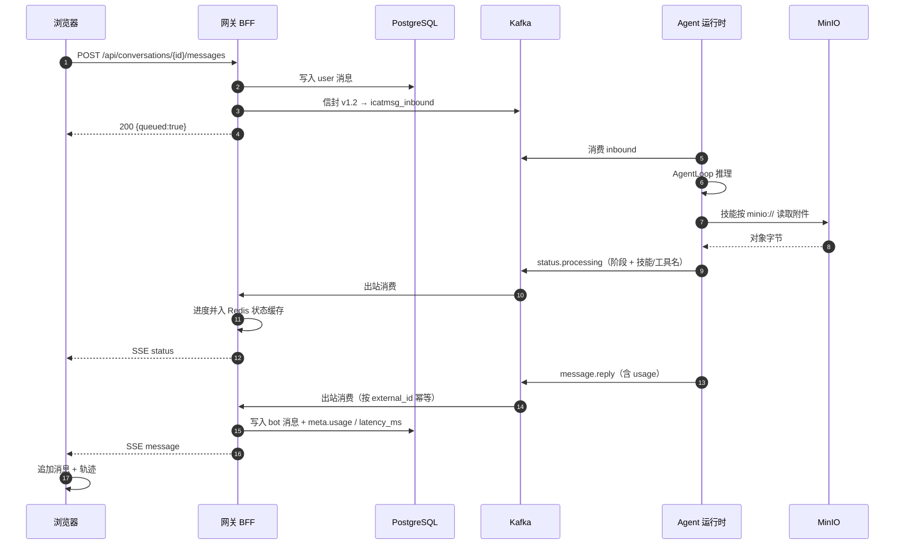

# thqbot 架构设计

> 本文描述**仓库里真实运行的那套**：组件职责、消息契约、数据流编号与关键取舍。
> 配图：[产品架构](architecture-product.svg) · [技术架构](architecture-tech.svg)

---

## 1. 全景

```
浏览器 (React 18 + SSE)
   │  REST /api/*                     SSE /api/stream
   ▼
网关 BFF（FastAPI，单应用后端 :8080，宿主 8090）
   ├─ 登录鉴权（PG 用户 + 签名 Cookie）
   ├─ 会话 / 消息 CRUD ─────────────► PostgreSQL（唯一事实来源）
   ├─ 附件上传下载 ─────────────────► MinIO（对象键含 user_id，归属按 PG 记录校验）
   ├─ 出站消费 ─► PG 落库 ─► Redis Pub/Sub ─► SSE
   └─ 入站生产（信封 v1.2，分区键 tenant|bot|account|chat）
            │
            ▼  Kafka: icatmsg_inbound
    Agent 运行时（ithqbot，:9002 健康检查）
      AgentLoop ─► 技能 / 工具 ─► LLM（OpenAI 兼容）
                   └─ 技能从同一个 MinIO bucket 直接读附件
            │
            ▼  Kafka: icatmsg_outbound（status.processing / message.reply / …）
        回到网关出站消费
```

一句话概括职责边界：**网关负责「用户可见的一切」，运行时负责「推理与执行」，Kafka 负责让两边不必知道对方的存在。**

---

## 2. 组件职责

| 组件 | 职责 | 不做什么 |
|---|---|---|
| **Web 工作台**（React 18 + Vite 6） | 对话 / 轨迹双视图、附件暂存、模型与权限提示、SSE 消费与轨迹累积 | 不做业务规则判断；不直接访问 Kafka/MinIO |
| **网关 BFF**（FastAPI） | 鉴权、会话与消息持久化、附件、SSE 扇出、信封构造与出站消费、静态托管前端 | 不调用 LLM；不执行技能 |
| **Kafka** | 入站 / 出站两个主题（各 3 分区），业务两侧解耦 | 不存储业务事实（PG 才是） |
| **Agent 运行时**（ithqbot） | AgentLoop 推理、技能加载与工具注册、LLM provider、工作区文件读写 | 不直接读写业务表；只通过信封交互 |
| **PostgreSQL** | 用户 / 会话 / 消息 / 附件元数据；运行时自己的 session / memory / cron / checkpoint | 不承担缓存职责 |
| **Redis** | 消费幂等去重、SSE Pub/Sub 通道、进度状态缓存、并发锁 | **不作为会话主存储**（见 §7） |
| **MinIO** | 附件与技能产物对象存储 | 不做权限判断（归属在 PG） |

---

## 3. 一条消息的完整旅程

与[技术架构图](architecture-tech.svg)右侧的编号一一对应：

| # | 步骤 | 关键点 |
|---|---|---|
| 1 | 浏览器 `POST /api/conversations/{id}/messages` | 同源 Cookie 鉴权；支持只发附件不发文字 |
| 2 | 网关写入 `messages` 行（user）→ 组装信封 v1.2 → 投递 `icatmsg_inbound` | 分区键 `tenant\|bot\|account\|chat`，保证同一会话有序 |
| 3 | 运行时消费 → AgentLoop 推理 → 调用技能 / 工具 | 每次调用 `emit_progress` |
| 4 | 每步进度回推 `status.processing` 到 `icatmsg_outbound` | 携带 `_tool_name` / `_skill_name` / `_call_type` |
| 5 | 网关把进度**并入** Redis 状态缓存（跨事件做并集） | 避免最后那个 `finalizing` 事件把技能名抹掉 |
| 6 | 回复落 PG（bot 行）→ Redis Pub/Sub → SSE 推给浏览器 | 出站消费按 `external_id` 幂等，重启不丢 |
| 7 | 前端按 SSE 事件累积出「轨迹」时间线 | 阶段、技能、工具、回复四类事件 |
| 8 | 回合结束把 `usage` 与 `latency_ms` 写回消息 `meta` | 真实 token 用量，不是估算 |



---

## 4. 消息信封契约 v1.2

由 `services/gateway/app/source_adapter.py::build_envelope` 构造，`CONTRACT_VERSION = "v1.2"`：

```json
{
  "header": {
    "version": "v1.2",
    "msg_id": "m-<uuid>",
    "timestamp": 1789294688005,
    "source": "thqbot-gateway",
    "event": "message.user",
    "trace_id": "u-<uuid>",
    "parent_msg_id": "<可选，回复指向原消息>"
  },
  "payload": {
    "channel": "icatmsg",
    "tenant_id": "thqbot",
    "bot_id": "bot_A",
    "account_id": "<user_id>",
    "chat_id": "<conversation_id>",
    "client_id": "thqbot-web",
    "content": "用户输入文本",
    "content_type": "text | file",
    "attachments": [ { "file_id": "...", "name": "...", "storage_uri": "minio://..." } ],
    "reply_to": "<可选>",
    "priority": "normal"
  },
  "metadata": {
    "request_msg_id": "u-<uuid>",
    "trace_id": "u-<uuid>",
    "attachments": [ "..." ]
  }
}
```

**事件类型**

| 方向 | 事件 | 含义 |
|---|---|---|
| 入站 | `message.user` | 用户消息（唯一入站事件） |
| 出站 | `status.processing` | 阶段推进 / 技能 / 工具进度 |
| 出站 | `message.reply` | 最终回复（携带 `usage`、`files`） |
| 出站 | `status.interaction` | 需要人机交互（如 OTP 校验） |
| 出站 | `message.file` | 技能产出文件 |

**分区键**：`tenant_id|bot_id|account_id|chat_id`（缺项自动跳过），保证同一会话的消息落在同一分区、保序。

**幂等**：出站消费以 `header.trace_id` / `msg_id` 作为 `external_id` 在 Redis 上 `SETNX + TTL` 去重，
重复事件直接被丢弃，因此**网关重启或重复投递都不会产生重复消息**。

---

## 5. 数据模型

| 表 | 作用 | 关键约束 |
|---|---|---|
| `users` | 登录用户（PBKDF2 口令散列） | `username` 唯一 |
| `conversations` | 会话 | `user_id` 归属；`bot_id`；未读计数 |
| `messages` | 消息 | `(conversation_id, seq)` 主键 + `external_id` 唯一（幂等锚点）；`meta` 存 progress / usage / latency_ms / files |
| `files` | 附件元数据 | `user_id` + 对象键；下载先查此表再取流 |

schema 由 **Alembic 拥有**（`alembic/versions/0001_initial.py`、`0002_files.py`），不依赖 ORM 隐式建表。
运行时自己的 session / memory / cron / checkpoint 表也在同一个 PostgreSQL 实例内。

## 6. Redis 键空间

| 键 | 用途 | TTL |
|---|---|---|
| `thqbot:dedupe:<user_id>:<external_id>` | 出站消费幂等 | `dedupe_ttl_seconds`（默认 7 天） |
| `thqbot:events:<user_id>` | SSE Pub/Sub 通道 | 通道本身不过期 |
| `thqbot:status:<user_id>:<conversation_id>` | 最近一次进度状态，供历史消息回填技能名 | `status_cache_ttl_seconds`（默认 1 小时） |
| `thqbot:lock:conversation:<conversation_id>` | 会话级并发锁 | 短 TTL |

---

## 7. 关键设计决策与取舍

| 决策 | 理由 | 代价 |
|---|---|---|
| **PostgreSQL 是唯一事实来源** | 消息、会话、附件归属都要能溯源、能审计；Redis 丢失不应影响正确性 | 每次读写都走 PG，需要索引与分页游标 |
| **Redis 只做缓存 / 通道 / 锁**（不做会话主存储） | 早期实现把会话放 Redis 导致重启即丢、无历史可查；换掉之后消息可回放 | 需要显式处理"缓存未命中"（如历史消息的技能名回填） |
| **前后端通过 Kafka 解耦** | 网关可独立重启、可水平扩展；agent 长任务不阻塞 HTTP 请求 | 需要信封契约与幂等设计，调试链路变长 |
| **进度元数据跨事件做并集** | 末次 `finalizing` 事件不带技能名，若直接覆盖会丢失"调用了哪个技能" | 状态缓存需要 TTL 与合并逻辑 |
| **附件下载按 PG 记录校验归属** | 路径前缀校验可被构造绕过；按记录查询越权天然 404 | 每次下载多一次 PG 查询 |
| **技能直读对象存储（`minio://`）** | 大文件零拷贝，技能不必关心上传细节 | 技能需要被授予对象存储凭据 |
| **不引第三方 UI / Markdown 库** | `innerHTML` 归零，XSS 面为零；产物小、可控 | 需要自研解析器并自己测（已有 18 个解析用例） |
| **不做 token 级流式输出** | 进度实时 + 完整回复已满足"看得见"；逐字流式会显著增加前端与协议复杂度 | 首字延迟等于整轮耗时 |

---

## 8. 部署与端口

| 组件 | 容器端口 | 宿主端口 | 备注 |
|---|---|---|---|
| 网关 BFF | 8080 | `GATEWAY_PORT`（默认 8090） | 同时托管前端静态资源 |
| Agent 运行时 | 9002（健康检查） | `ITHQBOT_HEALTH_PORT` | 无常驻 HTTP API，靠 Kafka 驱动 |
| Kafka | 9092（容器内）/ 29092（宿主） | `KAFKA_PORT` | KRaft 模式，双 listener |
| PostgreSQL | 5432 | `POSTGRES_PORT` | 数据卷 `pgdata` |
| MinIO | 9000 / 9001（控制台） | `MINIO_PORT` / `MINIO_CONSOLE_PORT` | bucket 由网关启动时确保存在 |
| Redis | — | 6379 | **刻意不由本仓库托管**，复用你已有的实例 |

编排文件：`docker-compose.yml`（项目名 `thqbot`，容器名前缀 `thqbot-*`）。

## 9. 扩展点：加一个技能

1. 在 `services/ithqbot/ithqbot/skills/<name>/` 下建目录，遵循 `ithqbot/docs/SKILL_STANDARDS.md`：
   `SKILL.md`（声明能力与触发条件）+ `tool/tool_def.json` + `tool/tool.py` + `capability.json`；
2. 工具会被自动发现并注册（`agent/skills` 的加载器 + `agent/runtime/tooling.py` 注册）；
3. 单测就近放在 `skills/<name>/tests/`，`python -m pytest` 会一并收集；
4. 前端若要展示专属产物，复用消息 `meta.files[]` 契约即可（会自动渲染成文件卡片）。

参考实现：`skills/text_stats/`（确定性统计，含完整测试）与 `agent/tools/files.py`（`read_file` 沙箱：工作区 + 内置技能目录，越界拒绝、超长截断、支持行范围）。
