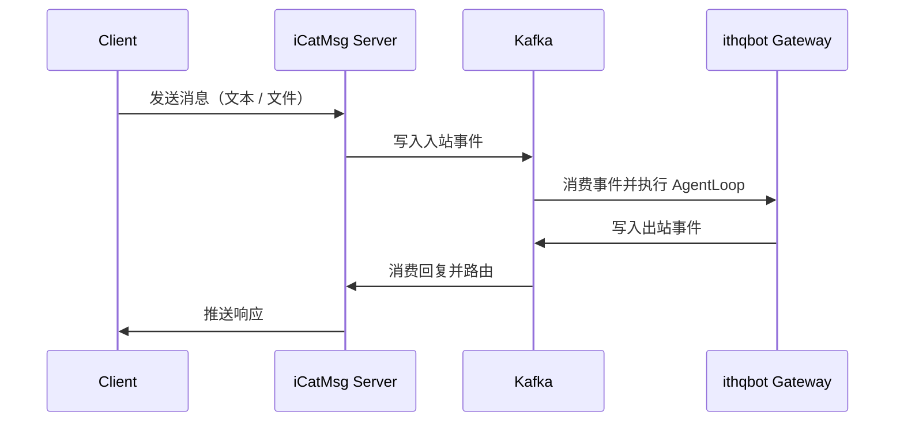

<div align="center">
  
  <h1>ithqbot：超轻量企业级个人 AI 助手</h1>
  <p>
    <a href="https://pypi.org/project/ithqbot-ai/"></a>
    <a href="https://pepy.tech/project/ithqbot-ai"></a>
    
    
    <a href="./COMMUNICATION.md"></a>
    <a href="./COMMUNICATION.md"></a>
    <a href="https://discord.gg/MnCvHqpUGB"></a>
  </p>
</div>

🐈 **ithqbot** 是一个 **超轻量** 的个人 AI 助手，设计目标是以更低复杂度交付完整的 agent 能力。

⚡️ 在保持核心能力的同时，代码体量显著收敛，更便于部署、阅读、二次开发与企业集成。

📏 如需查看核心代码规模，可随时运行 `bash core_agent_lines.sh`。

## 📢 动态

- **2026-03-15** 🧩 增强钉钉富媒体支持，内置技能更智能，模型兼容性更清晰。
- **2026-03-14** 💬 新增频道插件能力，飞书回复链路、MCP、QQ 与媒体处理更稳健。
- **2026-03-13** 🌐 支持多提供方联网搜索，接入 LangSmith，并进一步提升整体稳定性。
- **2026-03-12** 🚀 新增火山引擎支持，补齐 Telegram 回复上下文、`/restart` 与记忆链路增强。
- **2026-03-11** 🔌 增强企业微信、Ollama、能力发现与工具安全行为。
- **2026-03-10** 🧠 引入基于 token 的记忆策略，统一重试逻辑，并优化网关与 Telegram 表现。
- **2026-03-09** 💬 优化 Slack 线程交互，并改进飞书音频兼容性。
- **2026-03-08** 🚀 发布 **v0.1.4.post4**，重点增强默认安全性、多实例支持、MCP 稳定性以及频道与提供方能力。
- **2026-03-07** 🚀 新增 Azure OpenAI 提供方、WhatsApp 媒体支持、QQ 群聊适配，以及更多 Telegram / 飞书优化。
- **2026-03-06** 🪄 精简 provider 实现，增强媒体处理，并改善记忆与 CLI 兼容性。

## ithqbot 核心特性

🪶 **超轻量**：聚焦核心能力，部署更快、维护更轻。

🔬 **易研究**：代码结构清晰，可读性高，便于理解、修改与扩展。

⚡️ **响应快**：更小的体积意味着更低资源占用和更短启动时间。

💎 **易上手**：初始化步骤精简，适合个人与团队快速落地。

- **Web UI 与联网搜索**：可选 React 前端，并内置 Brave / DuckDuckGo 等联网能力。
- **多租户存储**：支持Redis、PostgreSQL 等多种会话存储后端，适配企业场景。

## 🏗️ 架构

<p align="center">
  
</p>

## 🔗 ithqbot 企业集成模式

ithqbot 企业集成模式使用 Kafka 作为消息骨干，将渠道接入（`icatmsg-server`）与 AI 执行（`ithqbot gateway`）解耦，并支持租户、账号、会话三级隔离。

### 核心能力

- **事件驱动流水线**：通过 Kafka topic 异步接入和回传消息。
- **会话隔离**：按 `tenant_id + account_id + chat_id` 维持独立记忆上下文。
- **多机器人分发**：基于 `tenant_id + bot_id` 路由不同角色或职责的机器人。
- **多附件处理**：单次请求可携带多个 MinIO 文件引用。
- **租户感知上下文**：通过 `tenant_id` 在链路内透传元数据。

### 消息流转



### 快速运行（集成模式）

```bash
docker-compose up -d
python3 icatmsg/server/app.py
PYTHONPATH=. python3 -m ithqbot gateway
python3 icatmsg/client/cli.py my_user_id
```

### ithqbot 文档

- [API](ithqbot/docs/API.md)
- [Design](ithqbot/docs/DESIGN.md)
- [Operation Guide](ithqbot/docs/OPERATION_GUIDE.md)
- [PRD](ithqbot/docs/PRD.md)
- [Test Plan](ithqbot/docs/TEST.md)
- [待实现能力](ithqbot/docs/PENDING_FEATURES.md)
- [icatmsg Design](icatmsg/docs/DESIGN.md)
- [icatmsg Operation Guide](icatmsg/docs/OPERATION_GUIDE.md)
- [icatmsg Protocol v1.2](icatmsg/docs/PROTOCOL_V1_2.md)
- [icatmsg 待实现能力](icatmsg/docs/PENDING_FEATURES.md)


> **License 说明**：本项目遵循 MIT License，并保留原始许可证与版权声明。

## 目录

- [动态](#-动态)
- [核心特性](#ithqbot-核心特性)
- [架构](#️-架构)
- [ithqbot 企业集成模式](#-ithqbot-企业集成模式)
- [功能展示](#-features)
- [安装](#-install)
- [快速开始](#-quick-start)
- [聊天应用](#-chat-apps)
- [Agent 社交网络](#-agent-social-network)
- [配置](#️-configuration)
- [多实例](#-multiple-instances)
- [CLI 参考](#-cli-reference)
- [Docker](#-docker)
- [Linux 服务](#-linux-service)
- [项目结构](#-project-structure)
- [贡献与路线图](#-contribute--roadmap)


## 📦 安装

**从源码安装**（适合开发，功能最新）

```bash
git clone <项目仓库地址> ithqbot
cd ithqbot
pip install -e .
```

**使用 [uv](https://github.com/astral-sh/uv) 安装**（稳定、快速）

```bash
uv tool install ithqbot-ai
```

**从 PyPI 安装**（稳定）

```bash
pip install ithqbot-ai
```

### 升级到最新版本

**PyPI / pip**

```bash
pip install -U ithqbot-ai
ithqbot --version
```

**uv**

```bash
uv tool upgrade ithqbot-ai
ithqbot --version
```

**如果使用 WhatsApp**，升级后请重建本地桥接：

```bash
rm -rf ~/.ithqbot/bridge
ithqbot channels login
```

## 🚀 快速开始

> [!TIP]
> 请先在 `~/.ithqbot/config.json` 中填入 API Key。
> 可通过 [OpenRouter](https://openrouter.ai/keys) 获取。
>
> 如需配置联网搜索，请参见下方 [联网搜索](#联网搜索) 章节。

**1. 初始化**

```bash
ithqbot onboard
```

**2. 配置**（`~/.ithqbot/config.json`）

将下面 **两部分** 配置加入或合并到现有配置中（其余选项都有默认值）。

*设置 API Key*（例如 OpenRouter）：
```json
{
  "providers": {
    "openrouter": {
      "apiKey": "sk-or-v1-xxx"
    }
  }
}
```

*设置模型*（也可显式指定 provider；默认会自动识别）：
```json
{
  "agents": {
    "defaults": {
      "model": "anthropic/claude-opus-4-5",
      "provider": "openrouter"
    }
  }
}
```

*Enable two-stage model routing* (small model for intent classification, larger model for writing/coding):
```json
{
  "agents": {
    "defaults": {
      "model": "anthropic/claude-sonnet-4-5"
    },
    "routing": {
      "enabled": true,
      "routerModel": "openrouter/qwen/qwen3-8b",
      "classifierTemperature": 0.0,
      "classifierMaxTokens": 256,
      "thresholds": {
        "confidenceMin": 0.72
      },
      "tiers": {
        "small": { "model": "openrouter/qwen/qwen3-8b", "maxTokens": 2048, "reasoningEffort": "low" },
        "medium": { "model": "openrouter/deepseek/deepseek-chat", "maxTokens": 4096, "reasoningEffort": "medium" },
        "large": { "model": "openrouter/anthropic/claude-sonnet-4-5", "maxTokens": 8192, "reasoningEffort": "high" }
      },
      "fallbacks": {
        "small": ["medium", "large"],
        "medium": ["large"],
        "large": []
      },
      "rules": [
        { "name": "coding", "keywords": ["代码", "coding", "bug", "stack trace"], "tier": "large" },
        { "name": "writing", "keywords": ["写作", "润色", "文案"], "tier": "large" }
      ]
    }
  }
}
```

> ```json
> {
>   "agents": {
>     "defaults": {
>       "sessionStoreUri": "redis://:password@localhost:6379/0"
>     }
>   }
> }
> ```
>
> ### 远程配置存储 (v0.1.4.post6+)
> 你可以将机器人配置存储在 Redis 或 DB 中。本地 `config.json` 仅作为引导：
> ```json
> {
>   "configStoreType": "redis",
>   "configStoreUri": "redis://localhost:6379/0",
>   "botId": "bot_A"
> }
> ```
>
> 同时也支持 **国密 (SM4)** 加密存储敏感信息：
> ```json
> {
>   "encryptionEnabled": true,
>   "encryptionAlgorithm": "sm4",
>   "encryptionKey": "your_master_key"
> }
> ```

**3. 开始对话**

```bash
ithqbot agent
```

到这里就完成了，你已经在大约 2 分钟内拥有一个可用的 AI 助手。

### 两阶段模型路由行为

- 第 1 阶段使用 `agents.routing.routerModel` 输出结构化路由字段，如 `suggested_tier`、`confidence`、`risk`。
- 第 2 阶段从 `agents.routing.tiers` 中选择模型，并使用该模型运行主 agent 循环。
- `agents.routing.rules` 的优先级高于分类器结果。
- 如果分类器置信度低于 `thresholds.confidenceMin`，路由会自动提升一个层级。
- 如果已选模型失败，会按 `agents.routing.fallbacks` 继续回退并重试下一个层级模型。

## 💬 聊天应用

你可以将 ithqbot 接入常用聊天平台。如需自定义渠道，请参见 [频道插件指南](ithqbot/docs/CHANNEL_PLUGIN_GUIDE.md)。

> 频道插件能力当前已包含在 `main` 分支中，但尚未发布到 PyPI。

| 渠道 | 需要准备的内容 |
|---------|---------------|
| **Telegram** | 从 `@BotFather` 获取机器人令牌（Bot Token） |
| **Discord** | 机器人令牌（Bot Token）+ Message Content Intent |
| **WhatsApp** | 扫码登录 |
| **Feishu** | App ID + App Secret |
| **Mochat** | Claw 令牌（Claw Token，支持自动配置） |
| **DingTalk** | App Key + App Secret |
| **Slack** | 机器人令牌（Bot Token）+ 应用级令牌（App-Level Token） |
| **Email** | IMAP/SMTP 凭据 |
| **QQ** | App ID + App Secret |
| **Wecom** | 机器人 ID（Bot ID）+ 机器人密钥（Bot Secret） |

<details>
<summary><b>Telegram</b>（推荐）</summary>

**1. 创建 Bot**
- 打开 Telegram，搜索 `@BotFather`
- 发送 `/newbot`，按提示完成创建
- 复制生成的令牌（token）

**2. 配置**

```json
{
  "channels": {
    "telegram": {
      "enabled": true,
      "token": "YOUR_BOT_TOKEN",
      "allowFrom": ["YOUR_USER_ID"]
    }
  }
}
```

> 你可以在 Telegram 设置中找到自己的 **User ID**，通常显示为 `@yourUserId`。
> 请复制其中 **不带 `@` 符号** 的部分，并填入配置文件。


**3. 运行**

```bash
ithqbot gateway
```

</details>

<details>
<summary><b>Mochat</b></summary>

默认优先使用 **Socket.IO WebSocket**，并可回退到 HTTP polling。

**1. 让 ithqbot 帮你配置 Mochat**

直接把下面这段话发送给 ithqbot（把 `xxx@xxx` 替换成你的真实邮箱）：

```
请读取 Mochat 的 ithqbot 技能安装说明，并帮我完成 Mochat 注册。我的邮箱是 xxx@xxx，请将我绑定为 owner，并通过 Mochat 私信我。
```

ithqbot 会自动完成注册、写入 `~/.ithqbot/config.json` 并连接到 Mochat。

**2. 重启网关**

```bash
ithqbot gateway
```

完成后其余步骤会由 ithqbot 自动处理。

<br>

<details>
<summary>手动配置（高级）</summary>

如果你更希望手动配置，可将以下内容加入 `~/.ithqbot/config.json`：

> 请妥善保管 `claw_token`。它只应通过 `X-Claw-Token` 请求头发送到你的 Mochat API 端点。

```json
{
  "channels": {
    "mochat": {
      "enabled": true,
      "base_url": "https://mochat.io",
      "socket_url": "https://mochat.io",
      "socket_path": "/socket.io",
      "claw_token": "claw_xxx",
      "agent_user_id": "6982abcdef",
      "sessions": ["*"],
      "panels": ["*"],
      "reply_delay_mode": "non-mention",
      "reply_delay_ms": 120000
    }
  }
}
```


</details>

</details>

<details>
<summary><b>Discord</b></summary>

**1. 创建 Bot**
- 打开 https://discord.com/developers/applications
- 创建应用后进入 Bot 页面并点击 Add Bot
- 复制机器人令牌（Bot Token）

**2. 启用 Intent**
- 在 Bot 设置中启用 **MESSAGE CONTENT INTENT**
- 如需基于成员信息做 allow list，可额外启用 **SERVER MEMBERS INTENT**

**3. 获取 User ID**
- 进入 Discord Settings → Advanced，启用 **Developer Mode**
- 右键你的头像，选择 **Copy User ID**

**4. 配置**

```json
{
  "channels": {
    "discord": {
      "enabled": true,
      "token": "YOUR_BOT_TOKEN",
      "allowFrom": ["YOUR_USER_ID"],
      "groupPolicy": "mention"
    }
  }
}
```

> `groupPolicy` 用于控制机器人在群聊中的响应方式：
> - `"mention"`（默认）: 仅在被 @ 时响应
> - `"open"`: 响应所有消息
> 私聊场景下，只要发送方位于 `allowFrom` 中就会响应。

**5. 邀请 Bot**
- 打开 OAuth2 → URL Generator
- Scopes 选择 `bot`
- Bot Permissions 至少勾选 `Send Messages` 和 `Read Message History`
- 打开生成的邀请链接，将机器人添加到你的服务器

**6. 运行**

```bash
ithqbot gateway
```

</details>

<details>
<summary><b>Matrix（Element）</b></summary>

请先安装 Matrix 依赖：

```bash
pip install ithqbot-ai[matrix]
```

**1. 创建或选择 Matrix 账号**

- 在你的 homeserver（例如 `matrix.org`）上创建或复用一个 Matrix 账号。
- 确认你可以使用 Element 正常登录。

**2. 获取凭据**

- 你需要准备：
  - `userId`（例如：`@ithqbot:matrix.org`）
  - `accessToken`
  - `deviceId`（建议配置，这样重启后可恢复 sync token）
- 这些信息可通过 homeserver 登录 API（`/_matrix/client/v3/login`）或客户端的高级会话设置获取。

**3. 配置**

```json
{
  "channels": {
    "matrix": {
      "enabled": true,
      "homeserver": "https://matrix.org",
      "userId": "@ithqbot:matrix.org",
      "accessToken": "syt_xxx",
      "deviceId": "ITHQBOT01",
      "e2eeEnabled": true,
      "allowFrom": ["@your_user:matrix.org"],
      "groupPolicy": "open",
      "groupAllowFrom": [],
      "allowRoomMentions": false,
      "maxMediaBytes": 20971520
    }
  }
}
```

> 请保持 `matrix-store` 持久化，并为 `deviceId` 使用稳定值；否则重启后加密会话状态可能丢失。

| 选项 | 说明 |
|--------|-------------|
| `allowFrom` | 允许交互的用户 ID 列表；空数组表示拒绝全部，`["*"]` 表示允许所有人。 |
| `groupPolicy` | 可选 `open`（默认）、`mention` 或 `allowlist`。 |
| `groupAllowFrom` | 房间 allowlist，仅在 `groupPolicy=allowlist` 时生效。 |
| `allowRoomMentions` | 在 mention 模式下是否接受 `@room` 提及。 |
| `e2eeEnabled` | 是否启用 E2EE，默认 `true`；若只需明文消息可设为 `false`。 |
| `maxMediaBytes` | 附件大小上限，默认 `20MB`；设为 `0` 表示禁止所有媒体。 |


**4. 运行**

```bash
ithqbot gateway
```

</details>

<details>
<summary><b>WhatsApp</b></summary>

需要 **Node.js ≥18**。

**1. 绑定设备**

```bash
ithqbot channels login
# 使用 WhatsApp 扫码：设置 → 已关联设备
```

**2. 配置**

```json
{
  "channels": {
    "whatsapp": {
      "enabled": true,
      "allowFrom": ["+1234567890"]
    }
  }
}
```

**3. 运行**（两个终端）

```bash
# 终端 1
ithqbot channels login

# 终端 2
ithqbot gateway
```

> 已有安装不会自动更新 WhatsApp 本地桥接。
> 升级 ithqbot 后，请执行以下命令重建桥接：
> `rm -rf ~/.ithqbot/bridge && ithqbot channels login`

</details>

<details>
<summary><b>Feishu (飞书)</b></summary>

使用 **WebSocket 长连接**，无需公网 IP。

**1. 创建飞书机器人**
- 访问 [飞书开放平台](https://open.feishu.cn/app)
- 创建应用并启用 **Bot** 能力
- **权限**：添加 `im:message`（发消息）和 `im:message.p2p_msg:readonly`（收消息）
- **事件**：添加 `im.message.receive_v1`（接收消息）
  - 选择 **长连接** 模式（需要先启动 ithqbot 建立连接）
- 在“凭证与基础信息”中获取 **App ID** 和 **App Secret**
- 发布应用

**2. 配置**

```json
{
  "channels": {
    "feishu": {
      "enabled": true,
      "appId": "cli_xxx",
      "appSecret": "xxx",
      "encryptKey": "",
      "verificationToken": "",
      "allowFrom": ["ou_YOUR_OPEN_ID"],
      "groupPolicy": "mention"
    }
  }
}
```

> `encryptKey` 和 `verificationToken` 在长连接模式下可选。
> `allowFrom`：填写你的 open_id，可在给机器人发消息后从 ithqbot 日志中找到；`["*"]` 表示允许所有用户。
> `groupPolicy`：`"mention"`（默认，仅在被 @ 时响应）或 `"open"`（响应所有群消息）；私聊始终会响应。

**3. 运行**

```bash
ithqbot gateway
```

> [!TIP]
> 飞书通过 WebSocket 接收消息，无需 webhook 或公网 IP。

</details>

<details>
<summary><b>QQ (QQ单聊)</b></summary>

使用 **botpy SDK + WebSocket**，无需公网 IP，目前仅支持 **QQ 单聊**。

**1. 注册并创建 Bot**
- 访问 [QQ 开放平台](https://q.qq.com)，注册开发者账号（个人或企业均可）
- 创建新的机器人应用
- 打开 **开发设置**，复制 **AppID** 和 **AppSecret**

**2. 配置沙箱测试**
- 在机器人管理后台找到 **沙箱配置**
- 在 **在消息列表配置** 中点击 **添加成员**，加入你自己的 QQ 号
- 添加后，用手机 QQ 扫描机器人的二维码，进入机器人资料页后点击“发消息”开始测试

**3. 配置**

> - `allowFrom`：填写你的 openid，可在给机器人发消息后从 ithqbot 日志中查看；`["*"]` 表示公开访问。
> - `msgFormat`：可选。`"plain"`（默认）兼容性最好；`"markdown"` 更适合新版客户端的富文本展示。
> - 生产环境发布前，请先在机器人后台提交审核并发布，完整流程可参见 [QQ Bot 文档](https://bot.q.qq.com/wiki/)。

```json
{
  "channels": {
    "qq": {
      "enabled": true,
      "appId": "YOUR_APP_ID",
      "secret": "YOUR_APP_SECRET",
      "allowFrom": ["YOUR_OPENID"],
      "msgFormat": "plain"
    }
  }
}
```

**4. 运行**

```bash
ithqbot gateway
```

现在可以从 QQ 向机器人发送消息，正常情况下它会进行回复。

</details>

<details>
<summary><b>DingTalk (钉钉)</b></summary>

使用 **Stream Mode**，无需公网 IP。

**1. 创建钉钉机器人**
- 访问 [钉钉开放平台](https://open-dev.dingtalk.com/)
- 创建应用并添加 **Robot** 能力
- **配置项**：
  - 打开 **Stream Mode**
- **权限**：补充发送消息所需的权限
- 在“凭证”中获取 **AppKey**（Client ID）和 **AppSecret**（Client Secret）
- 发布应用

**2. 配置**

```json
{
  "channels": {
    "dingtalk": {
      "enabled": true,
      "clientId": "YOUR_APP_KEY",
      "clientSecret": "YOUR_APP_SECRET",
      "allowFrom": ["YOUR_STAFF_ID"]
    }
  }
}
```

> `allowFrom`：填写你的 staff ID；`["*"]` 表示允许所有用户。

**3. 运行**

```bash
ithqbot gateway
```

</details>

<details>
<summary><b>Slack</b></summary>

使用 **Socket Mode**，无需公网 URL。

**1. 创建 Slack 应用**
- 打开 [Slack API](https://api.slack.com/apps)，点击 **Create New App** → `From scratch`
- 为应用命名并选择目标工作区

**2. 配置应用**
- **Socket Mode**：打开开关，生成带 `connections:write` 权限的 **应用级令牌**（App-Level Token），并复制该值（`xapp-...`）
- **OAuth & Permissions**：添加 bot scopes：`chat:write`、`reactions:write`、`app_mentions:read`
- **Event Subscriptions**：打开开关，订阅 `message.im`、`message.channels`、`app_mention` 等 bot 事件并保存
- **App Home**：在 **Show Tabs** 中启用 **Messages Tab**，勾选 **Allow users to send Slash commands and messages from the messages tab**
- **安装应用**：点击 **Install to Workspace**，授权后复制 **机器人令牌**（Bot Token，`xoxb-...`）

**3. 配置 ithqbot**

```json
{
  "channels": {
    "slack": {
      "enabled": true,
      "botToken": "xoxb-...",
      "appToken": "xapp-...",
      "allowFrom": ["YOUR_SLACK_USER_ID"],
      "groupPolicy": "mention"
    }
  }
}
```

**4. 运行**

```bash
ithqbot gateway
```

你可以直接私聊机器人，或在频道中 @ 它，正常情况下它都会响应。

> [!TIP]
> - `groupPolicy`：`"mention"`（默认，仅在被 @ 时响应）、`"open"`（响应所有频道消息）或 `"allowlist"`（限制在指定频道中响应）。
> - DM 默认允许；如需禁用私聊，可设置 `"dm": {"enabled": false}`。

</details>

<details>
<summary><b>Email</b></summary>

你可以为 ithqbot 配置一个独立邮箱。它会通过 **IMAP** 轮询收件箱，并使用 **SMTP** 自动回复，就像一个个人邮件助理。

**1. 获取凭据**（以 Gmail 为例）
- 为机器人创建一个专用 Gmail 账号，例如 `my-ithqbot@gmail.com`
- 启用两步验证，然后创建 [应用专用密码](https://myaccount.google.com/apppasswords)
- IMAP 和 SMTP 都使用这组应用专用密码

**2. 配置**

> - `consentGranted` 必须设为 `true` 才允许访问邮箱，这是一个安全开关；设为 `false` 可完全禁用。
> - `allowFrom`：填写允许来信的邮箱地址；`["*"]` 表示接受所有来源。
> - `smtpUseTls` 和 `smtpUseSsl` 默认分别为 `true` / `false`，这正好适用于 Gmail（587 + STARTTLS），通常无需显式设置。
> - 如果只想读取或分析邮件而不自动回复，请设置 `"autoReplyEnabled": false`。

```json
{
  "channels": {
    "email": {
      "enabled": true,
      "consentGranted": true,
      "imapHost": "imap.gmail.com",
      "imapPort": 993,
      "imapUsername": "my-ithqbot@gmail.com",
      "imapPassword": "your-app-password",
      "smtpHost": "smtp.gmail.com",
      "smtpPort": 587,
      "smtpUsername": "my-ithqbot@gmail.com",
      "smtpPassword": "your-app-password",
      "fromAddress": "my-ithqbot@gmail.com",
      "allowFrom": ["your-real-email@gmail.com"]
    }
  }
}
```


**3. 运行**

```bash
ithqbot gateway
```

</details>

<details>
<summary><b>Wecom (企业微信)</b></summary>

> 这里使用 [wecom-aibot-sdk-python](https://github.com/chengyongru/wecom_aibot_sdk)，它是官方 [@wecom/aibot-node-sdk](https://www.npmjs.com/package/@wecom/aibot-node-sdk) 的社区 Python 实现。
>
> 使用 **WebSocket 长连接**，无需公网 IP。

**1. 安装可选依赖**

```bash
pip install ithqbot-ai[wecom]
```

**2. 创建企业微信 AI 机器人**

进入企业微信管理后台 → 智能机器人 → 创建机器人，选择 **API 模式** 和 **长连接**，然后复制机器人 ID（Bot ID）和密钥（Secret）。

**3. 配置**

```json
{
  "channels": {
    "wecom": {
      "enabled": true,
      "botId": "your_bot_id",
      "secret": "your_bot_secret",
      "allowFrom": ["your_id"]
    }
  }
}
```

**4. 运行**

```bash
ithqbot gateway
```

</details>

## 🌐 Agent 社交网络

🐈 ithqbot 可以接入 agent 社交网络（agent community）。**你只需要发一条消息，它就会自动完成加入流程。**

| 平台 | 加入方式（把这句话发给你的机器人） |
|----------|-------------|
| [**Moltbook**](https://www.moltbook.com/) | `读取 https://moltbook.com/skill.md 并按说明加入 Moltbook` |
| [**ClawdChat**](https://clawdchat.ai/) | `读取 https://clawdchat.ai/skill.md 并按说明加入 ClawdChat` |

只需通过 CLI 或任意聊天渠道把上面的指令发送给 ithqbot，剩余步骤会自动完成。

## ⚙️ 配置

配置文件路径：`~/.ithqbot/config.json`

> [!IMPORTANT]
> Security-focused defaults are now stricter:
> - Set `ITHQBOT_STRICT_CONFIG=1` in production to reject startup when the active provider API key, MinIO credentials, or Kafka SASL credentials are incomplete.
> - Grant trace admin access only through `observability.adminAccountIds` or env vars `ITHQBOT_TRACE_ADMIN_ACCOUNTS` / `ITHQBOT_OBSERVABILITY_ADMIN_ACCOUNTS`.
> - `sessionStoreUri` / `memoryStoreUri` now retry initialization before falling back; set `requireExternalSessionStore` / `requireExternalMemoryStore` to `true` when fallback must be forbidden.

Example partial config:

```json
{
  "observability": {
    "adminAccountIds": ["alice_admin", "bob_admin"]
  },
  "agents": {
    "defaults": {
      "sessionStoreUri": "redis://localhost:6379/0",
      "memoryStoreUri": "postgresql://127.0.0.1:5432/ithqbot",
      "requireExternalSessionStore": false,
      "requireExternalMemoryStore": true
    }
  }
}
```

### 提供方

> [!TIP]
> - **Groq** 通过 Whisper 提供免费语音转写；如果已配置，Telegram 语音消息会自动转写。
> - **VolcEngine / BytePlus Coding Plan**：如果你使用的是编程计划，请优先使用 `volcengineCodingPlan` 或 `byteplusCodingPlan`，而不是按量计费的 `volcengine` / `byteplus`。
> - **智谱 Coding Plan**：如果你使用智谱编程计划，请在 zhipu 配置中设置 `"apiBase": "https://open.bigmodel.cn/api/coding/paas/v4"`。
> - **MiniMax（中国大陆）**：如果你的 API Key 来自 minimaxi.com，请在 minimax 配置中设置 `"apiBase": "https://api.minimaxi.com/v1"`。
> - **阿里云百炼**：如果你使用阿里云百炼的 OpenAI 兼容端点，请在 dashscope 配置中设置 `"apiBase": "https://dashscope.aliyuncs.com/compatible-mode/v1"`。
> - 各提供方（Provider）的 HTTP 重试语义现已统一：超时、连接失败以及 HTTP `429` / `5xx` 会被视为可重试的临时错误，其余 `4xx` 会立即返回，便于更快暴露配置问题。

| 提供方（Provider） | 用途 | 获取 API Key |
|----------|---------|-------------|
| `custom` | 任意 OpenAI 兼容端点（直连，不经 LiteLLM） | — |
| `openrouter` | LLM（推荐，可访问多种模型） | [openrouter.ai](https://openrouter.ai) |
| `volcengine` | LLM（火山引擎，按量计费） | [Coding Plan](https://www.volcengine.com/activity/codingplan?utm_campaign=ithqbot&utm_content=ithqbot&utm_medium=devrel&utm_source=OWO&utm_term=ithqbot) · [volcengine.com](https://www.volcengine.com) |
| `byteplus` | LLM（BytePlus 国际版，按量计费） | [Coding Plan](https://www.byteplus.com/en/activity/codingplan?utm_campaign=ithqbot&utm_content=ithqbot&utm_medium=devrel&utm_source=OWO&utm_term=ithqbot) · [byteplus.com](https://www.byteplus.com) |
| `anthropic` | LLM（Claude 直连） | [console.anthropic.com](https://console.anthropic.com) |
| `azure_openai` | LLM（Azure OpenAI） | [portal.azure.com](https://portal.azure.com) |
| `openai` | LLM（GPT 直连） | [platform.openai.com](https://platform.openai.com) |
| `deepseek` | LLM（DeepSeek 直连） | [platform.deepseek.com](https://platform.deepseek.com) |
| `groq` | LLM + **语音转写**（Whisper） | [console.groq.com](https://console.groq.com) |
| `gemini` | LLM（Gemini 直连） | [aistudio.google.com](https://aistudio.google.com) |
| `minimax` | LLM（MiniMax 直连） | [platform.minimaxi.com](https://platform.minimaxi.com) |
| `aihubmix` | LLM（API 网关，可访问多种模型） | [aihubmix.com](https://aihubmix.com) |
| `siliconflow` | LLM（SiliconFlow / 硅基流动） | [siliconflow.cn](https://siliconflow.cn) |
| `dashscope` | LLM（Qwen） | [dashscope.console.aliyun.com](https://dashscope.console.aliyun.com) |
| `moonshot` | LLM（Moonshot / Kimi） | [platform.moonshot.cn](https://platform.moonshot.cn) |
| `zhipu` | LLM（智谱 GLM） | [open.bigmodel.cn](https://open.bigmodel.cn) |
| `ollama` | LLM（本地 Ollama） | — |
| `vllm` | LLM（本地或任意 OpenAI 兼容服务） | — |
| `openai_codex` | LLM（Codex，OAuth） | `ithqbot provider login openai-codex` |
| `github_copilot` | LLM（GitHub Copilot，OAuth） | `ithqbot provider login github-copilot` |

<details>
<summary><b>OpenAI Codex (OAuth)</b></summary>

Codex uses OAuth instead of API keys. Requires a ChatGPT Plus or Pro account.

**1. 登录：**
```bash
ithqbot provider login openai-codex
```

**2. 设置模型**（合并到 `~/.ithqbot/config.json`）：
```json
{
  "agents": {
    "defaults": {
      "model": "openai-codex/gpt-5.1-codex"
    }
  }
}
```

**3. 对话：**
```bash
ithqbot agent -m "Hello!"

# 在本地指定特定工作区 / 配置文件
ithqbot agent -c ~/.ithqbot-telegram/config.json -m "Hello!"

# 在该配置基础上临时覆盖工作区
ithqbot agent -c ~/.ithqbot-telegram/config.json -w /tmp/ithqbot-telegram-test -m "Hello!"
```

> 如果使用 Docker，请通过 `docker run -it` 执行交互式 OAuth 登录。

</details>

<details>
<summary><b>自定义提供方（Provider，任意 OpenAI 兼容 API）</b></summary>

可直接连接任意 OpenAI 兼容端点，例如 LM Studio、llama.cpp、Together AI、Fireworks、Azure OpenAI，或任意自建服务。该模式会绕过 LiteLLM，并原样透传模型名。

```json
{
  "providers": {
    "custom": {
      "apiKey": "your-api-key",
      "apiBase": "https://api.your-provider.com/v1",
      "modelApiBases": {
        "qwen2.5-72b-instruct": "http://10.243.183.12:55032/llm/proxy/amcc/qwen72b/v1",
        "qwen2.5-32b-instruct": "http://10.243.183.12:55032/llm/proxy/amcc/qwen32b/v1"
      }
    }
  },
  "agents": {
    "defaults": {
      "provider": "custom",
      "model": "your-model-name"
    }
  }
}
```

> 对于不需要 API Key 的本地服务，可将 `apiKey` 设为任意非空字符串，例如 `"no-key"`。
>
> 当 `modelApiBases` 存在时，会优先按模型名路由到对应 `apiBase`，未命中时回退到 `providers.custom.apiBase`。
>
> `apiBase` 请填写到 `.../v1`，不要包含 `/chat/completions`（SDK 会自动拼接该路径）。

</details>

<details>
<summary><b>Ollama (local)</b></summary>

启动本地 Ollama 模型后，将以下配置加入 `config.json`：

**1. 启动 Ollama**（示例）：
```bash
ollama run llama3.2
```

**2. 写入配置**（片段，合并到 `~/.ithqbot/config.json`）：
```json
{
  "providers": {
    "ollama": {
      "apiBase": "http://localhost:11434"
    }
  },
  "agents": {
    "defaults": {
      "provider": "ollama",
      "model": "llama3.2"
    }
  }
}
```

> 当已配置 `providers.ollama.apiBase` 时，`provider: "auto"` 也能正常工作，但显式写成 `"provider": "ollama"` 更清晰。

</details>

<details>
<summary><b>vLLM (local / OpenAI-compatible)</b></summary>

启动你自己的 vLLM 或任意 OpenAI 兼容服务后，将以下配置加入 `config.json`：

**1. 启动服务**（示例）：
```bash
vllm serve meta-llama/Llama-3.1-8B-Instruct --port 8000
```

**2. 写入配置**（片段，合并到 `~/.ithqbot/config.json`）：

*提供方（Provider）配置，本地场景下 key 可为任意非空字符串：*
```json
{
  "providers": {
    "vllm": {
      "apiKey": "dummy",
      "apiBase": "http://localhost:8000/v1"
    }
  }
}
```

*模型配置：*
```json
{
  "agents": {
    "defaults": {
      "model": "meta-llama/Llama-3.1-8B-Instruct"
    }
  }
}
```

</details>

<details>
<summary><b>新增提供方（Provider，开发者指南）</b></summary>

ithqbot 使用 **Provider Registry**（`ithqbot/providers/registry.py`）作为单一真相源。
新增一个提供方（provider）只需要 **2 步**，无需修改 if-elif 链。

**步骤 1：** 在 `ithqbot/providers/registry.py` 的 `PROVIDERS` 中新增一条 `ProviderSpec`：

```python
ProviderSpec(
    name="myprovider",                   # 配置字段名
    keywords=("myprovider", "mymodel"),  # 自动匹配模型名时使用的关键字
    env_key="MYPROVIDER_API_KEY",        # 对应环境变量
    display_name="My Provider",          # 在 `ithqbot status` 中显示的名称
    model_prefix="myprovider",           # 自动前缀：model -> myprovider/model
    skip_prefixes=("myprovider/",),      # 避免重复加前缀
)
```

**步骤 2：** 在 `ithqbot/config/schema.py` 的 `ProvidersConfig` 中新增字段：

```python
class ProvidersConfig(BaseModel):
    ...
    myprovider: ProviderConfig = ProviderConfig()
```

完成后，环境变量注入、模型前缀处理、配置匹配以及 `ithqbot status` 展示都会自动生效。

**常见 `ProviderSpec` 选项：**

| 字段 | 说明 | 示例 |
|-------|-------------|---------|
| `model_prefix` | 为上游提供方自动补模型名前缀 | `"dashscope"` → `dashscope/qwen-max` |
| `skip_prefixes` | 如果模型名已带这些前缀，则不再重复补齐 | `("dashscope/", "openrouter/")` |
| `env_extras` | 需要额外注入的环境变量 | `(("ZHIPUAI_API_KEY", "{api_key}"),)` |
| `model_overrides` | 针对特定模型的参数覆盖 | `(("kimi-k2.5", {"temperature": 1.0}),)` |
| `is_gateway` | 是否可路由任意模型（如 OpenRouter） | `True` |
| `detect_by_key_prefix` | 按 API Key 前缀识别网关 | `"sk-or-"` |
| `detect_by_base_keyword` | 按 API Base URL 关键字识别网关 | `"openrouter"` |
| `strip_model_prefix` | 重加前缀前先移除已有前缀 | `True`（适用于 AiHubMix） |

</details>


### 联网搜索

> [!TIP]
> 可通过 `tools.web.proxy` 将所有 web 请求（搜索 + 抓取）统一走代理：
> ```json
> { "tools": { "web": { "proxy": "http://127.0.0.1:7890" } } }
> ```

ithqbot 支持多种联网搜索提供方，可在 `~/.ithqbot/config.json` 的 `tools.web.search` 中配置。

| 提供方 | 配置字段 | 环境变量回退 | 免费 |
|----------|--------------|------------------|------|
| `brave`（默认） | `apiKey` | `BRAVE_API_KEY` | 否 |
| `tavily` | `apiKey` | `TAVILY_API_KEY` | 否 |
| `jina` | `apiKey` | `JINA_API_KEY` | 免费层（1000 万 tokens） |
| `searxng` | `baseUrl` | `SEARXNG_BASE_URL` | 是（自建） |
| `duckduckgo` | — | — | 是 |

当缺少凭据时，ithqbot 会自动回退到 DuckDuckGo。

**Brave**（默认）：
```json
{
  "tools": {
    "web": {
      "search": {
        "provider": "brave",
        "apiKey": "BSA..."
      }
    }
  }
}
```

**Tavily:**
```json
{
  "tools": {
    "web": {
      "search": {
        "provider": "tavily",
        "apiKey": "tvly-..."
      }
    }
  }
}
```

**Jina**（免费层 1000 万 tokens）：
```json
{
  "tools": {
    "web": {
      "search": {
        "provider": "jina",
        "apiKey": "jina_..."
      }
    }
  }
}
```

**SearXNG**（自建，无需 API Key）：
```json
{
  "tools": {
    "web": {
      "search": {
        "provider": "searxng",
        "baseUrl": "https://searx.example"
      }
    }
  }
}
```

**DuckDuckGo**（零配置）：
```json
{
  "tools": {
    "web": {
      "search": {
        "provider": "duckduckgo"
      }
    }
  }
}
```

| 选项 | 类型 | 默认值 | 说明 |
|--------|------|---------|-------------|
| `provider` | string | `"brave"` | 搜索后端提供方：`brave`、`tavily`、`jina`、`searxng`、`duckduckgo` |
| `apiKey` | string | `""` | Brave 或 Tavily 使用的 API Key |
| `baseUrl` | string | `""` | SearXNG 的基础 URL |
| `maxResults` | integer | `5` | 单次搜索结果数（1 到 10） |

### MCP (Model Context Protocol)

> [!TIP]
> 配置格式兼容 Claude Desktop / Cursor，你可以直接从任意 MCP Server 的 README 中复制对应配置。

ithqbot supports [MCP](https://modelcontextprotocol.io/) — connect external tool servers and use them as native agent tools.

Add MCP servers to your `config.json`:

```json
{
  "tools": {
    "mcpServers": {
      "filesystem": {
        "command": "npx",
        "args": ["-y", "@modelcontextprotocol/server-filesystem", "/path/to/dir"]
      },
      "my-remote-mcp": {
        "url": "https://example.com/mcp/",
        "headers": {
          "Authorization": "Bearer xxxxx"
        }
      }
    }
  }
}
```

Two transport modes are supported:

| Mode | Config | Example |
|------|--------|---------|
| **Stdio** | `command` + `args` | Local process via `npx` / `uvx` |
| **HTTP** | `url` + `headers` (optional) | Remote endpoint (`https://mcp.example.com/sse`) |

对于较慢的 MCP 服务，可使用 `toolTimeout` 覆盖默认的单次 30 秒超时：

```json
{
  "tools": {
    "mcpServers": {
      "my-slow-server": {
        "url": "https://example.com/mcp/",
        "toolTimeout": 120
      }
    }
  }
}
```

可通过 `enabledTools` 仅注册某个 MCP 服务中的部分工具：

```json
{
  "tools": {
    "mcpServers": {
      "filesystem": {
        "command": "npx",
        "args": ["-y", "@modelcontextprotocol/server-filesystem", "/path/to/dir"],
        "enabledTools": ["read_file", "mcp_filesystem_write_file"]
      }
    }
  }
}
```

`enabledTools` 既支持原始 MCP 工具名（例如 `read_file`），也支持 ithqbot 包装后的工具名（例如 `mcp_filesystem_write_file`）。

- 省略 `enabledTools`，或设置为 `["*"]`，表示注册全部工具。
- 设置为 `[]`，表示不注册该服务的任何工具。
- 设置为非空列表，表示仅注册指定子集。

MCP 工具会在启动时自动发现并注册，LLM 可以像使用内置工具一样直接调用，无需额外配置。


### Security

> [!TIP]
> - 在生产环境中，建议将 `"restrictToWorkspace": true` 写入配置，用于限制 agent 的工作边界。
> - 在 `v0.1.4.post3` 及更早版本中，空的 `allowFrom` 会放行所有发送方；从 `v0.1.4.post4` 起，空 `allowFrom` 默认拒绝所有访问。如需全部放行，请显式设置 `"allowFrom": ["*"]`。

| 选项 | 默认值 | 说明 |
|--------|---------|-------------|
| `tools.restrictToWorkspace` | `false` | 设为 `true` 后，所有 agent 工具（shell、文件读写编辑、目录列表等）都会被限制在工作区（workspace）目录内，防止路径穿越和越界访问。 |
| `tools.exec.pathAppend` | `""` | 运行 shell 命令时附加到 `PATH` 的额外目录，例如 `/usr/sbin`。 |
| `channels.*.allowFrom` | `[]`（默认全部拒绝） | 用户 ID 白名单；空数组拒绝所有用户，`["*"]` 表示允许所有人。 |


## 🧩 多实例

你可以同时运行多个 ithqbot 实例，并为每个实例使用独立配置和运行时数据。主入口参数是 `--config`；如有需要，也可以用 `--workspace` 为某次运行临时覆盖工作区。推荐使用 `ithqbot runtime` 启动，`ithqbot gateway` 仅作为兼容别名保留。

### 快速开始

```bash
# 实例 A：Telegram 机器人
ithqbot runtime --config ~/.ithqbot-telegram/config.json

# 实例 B：Discord 机器人
ithqbot runtime --config ~/.ithqbot-discord/config.json

# 实例 C：飞书机器人（自定义端口）
ithqbot runtime --config ~/.ithqbot-feishu/config.json --port 18792
```

### 路径解析

使用 `--config` 时，ithqbot 会根据配置文件所在目录推导运行时数据目录。工作区默认仍取自 `agents.defaults.workspace`，除非你通过 `--workspace` 显式覆盖。

如果想在本地针对某个实例打开 CLI 会话，可执行：

```bash
ithqbot agent -c ~/.ithqbot-telegram/config.json -m "Hello from Telegram instance"
ithqbot agent -c ~/.ithqbot-discord/config.json -m "Hello from Discord instance"

# 可选：单次运行时临时覆盖工作区
ithqbot agent -c ~/.ithqbot-telegram/config.json -w /tmp/ithqbot-telegram-test
```

> `ithqbot agent` 会基于所选工作区 / 配置文件启动一个本地 CLI agent；它不会附着到已运行的 `ithqbot runtime` 进程，也不会通过该进程做代理。

| 组件 | 来源 | 示例 |
|-----------|---------------|---------|
| **Config** | `--config` 路径 | `~/.ithqbot-A/config.json` |
| **工作区（workspace）** | `--workspace` 或配置文件 | `~/.ithqbot-A/workspace/` |
| **Cron Jobs** | 配置目录 | `~/.ithqbot-A/cron/` |
| **媒体 / 运行时状态** | 配置目录 | `~/.ithqbot-A/media/` |

### 工作方式

- `--config` 决定要加载哪份配置文件。
- 默认情况下，工作区取自该配置中的 `agents.defaults.workspace`。
- 如果传入 `--workspace`，则会覆盖配置文件中的工作区。

### 最小配置步骤

1. 将基础配置复制到新的实例目录中。
2. 为该实例设置独立的 `agents.defaults.workspace` 工作区。
3. 使用 `--config` 启动该实例。

配置示例：

```json
{
  "agents": {
    "defaults": {
      "workspace": "~/.ithqbot-telegram/workspace",
      "model": "anthropic/claude-sonnet-4-6"
    }
  },
  "channels": {
    "telegram": {
      "enabled": true,
      "token": "YOUR_TELEGRAM_BOT_TOKEN"
    }
  },
  "gateway": {
    "port": 18790
  }
}
```

分别启动多个实例：

```bash
ithqbot runtime --config ~/.ithqbot-telegram/config.json
ithqbot runtime --config ~/.ithqbot-discord/config.json
```

如有需要，也可以在单次运行时临时覆盖工作区：

```bash
ithqbot runtime --config ~/.ithqbot-telegram/config.json --workspace /tmp/ithqbot-telegram-test
```

### 常见场景

- 为 Telegram、Discord、飞书等平台分别运行独立机器人
- 将测试环境与生产环境彻底隔离
- 为不同团队配置不同模型或提供方
- 通过独立配置和运行时数据服务多个租户

### 说明

- 多个实例同时运行时必须使用不同端口。
- 如果希望隔离记忆、会话和技能，请为每个实例配置不同工作区。
- `--workspace` 会覆盖配置文件中的工作区。
- Cron 任务和运行时媒体 / 状态目录均从配置目录派生。

## 💻 CLI 参考

| 命令 | 说明 |
|---------|-------------|
| `ithqbot onboard` | 初始化配置和工作区 |
| `ithqbot agent -m "..."` | 与 agent 对话 |
| `ithqbot agent -w <workspace>` | 针对指定工作区对话 |
| `ithqbot agent -w <workspace> -c <config>` | 针对指定工作区 / 配置文件对话 |
| `ithqbot agent` | 进入交互式聊天模式 |
| `ithqbot agent --no-markdown` | 以纯文本显示回复 |
| `ithqbot agent --logs` | 聊天时显示运行日志 |
| `ithqbot gateway` | 启动网关 |
| `ithqbot status` | 查看状态 |
| `ithqbot provider login openai-codex` | 为提供方执行 OAuth 登录 |
| `ithqbot channels login` | 绑定 WhatsApp（扫码） |
| `ithqbot channels status` | 查看渠道状态 |

交互模式可通过 `exit`、`quit`、`/exit`、`/quit`、`:q` 或 `Ctrl+D` 退出。

<details>
<summary><b>Heartbeat（周期任务）</b></summary>

网关每 30 分钟唤醒一次，并检查工作区中的 `HEARTBEAT.md`（`~/.ithqbot/workspace/HEARTBEAT.md`）。如果文件里存在任务，agent 会执行这些任务，并将结果发送到你最近活跃的聊天渠道。

**配置方式：** 编辑 `~/.ithqbot/workspace/HEARTBEAT.md`（由 `ithqbot onboard` 自动创建）：

```markdown
## 周期任务

- [ ] 检查天气预报并发送摘要
- [ ] 扫描收件箱中的紧急邮件
```

agent 也可以自行维护这个文件。你只要告诉它“新增一个周期任务”，它就会自动帮你更新 `HEARTBEAT.md`。

> **说明：** 必须先启动网关（`ithqbot gateway`），并且你至少与机器人聊过一次，这样它才知道应将结果发送到哪个渠道。

</details>

## 🐳 Docker

> [!TIP]
> `-v ~/.ithqbot:/root/.ithqbot` 会将本地配置目录挂载到容器中，因此配置和工作区（workspace）可以在容器重启后继续保留。

### Docker Compose 用法

```bash
docker compose run --rm ithqbot-cli onboard   # 首次初始化
vim ~/.ithqbot/config.json                     # 填入 API Key
docker compose up -d ithqbot-gateway           # 启动网关
```

```bash
docker compose run --rm ithqbot-cli agent -m "你好！"   # 运行 CLI
docker compose logs -f ithqbot-gateway                  # 查看日志
docker compose down                                     # 停止容器
```

### Docker 直接运行

```bash
# 构建镜像
docker build -t ithqbot .

# 初始化配置（仅首次需要）
docker run -v ~/.ithqbot:/root/.ithqbot --rm ithqbot onboard

# 在宿主机编辑配置并填入 API Key
vim ~/.ithqbot/config.json

# 运行网关（连接已启用的渠道，例如 Telegram / Discord / Mochat）
docker run -v ~/.ithqbot:/root/.ithqbot -p 18790:18790 ithqbot gateway

# 或者直接执行单条命令
docker run -v ~/.ithqbot:/root/.ithqbot --rm ithqbot agent -m "你好！"
docker run -v ~/.ithqbot:/root/.ithqbot --rm ithqbot status
```

## 🐧 Linux 服务

你可以将网关配置为 systemd 用户服务，以便自动启动并在失败后自动重启。

**1. 找到 ithqbot 可执行文件路径：**

```bash
which ithqbot   # 例如 /home/user/.local/bin/ithqbot
```

**2. 创建服务文件** `~/.config/systemd/user/ithqbot-gateway.service`（如有需要请替换 `ExecStart` 路径）：

```ini
[Unit]
Description=ithqbot Gateway
After=network.target

[Service]
Type=simple
ExecStart=%h/.local/bin/ithqbot gateway
Restart=always
RestartSec=10
NoNewPrivileges=yes
ProtectSystem=strict
ReadWritePaths=%h

[Install]
WantedBy=default.target
```

**3. 启用并启动：**

```bash
systemctl --user daemon-reload
systemctl --user enable --now ithqbot-gateway
```

**常用操作：**

```bash
systemctl --user status ithqbot-gateway        # 查看状态
systemctl --user restart ithqbot-gateway       # 配置变更后重启
journalctl --user -u ithqbot-gateway -f        # 持续查看日志
```

如果你修改了 `.service` 文件本身，请先执行 `systemctl --user daemon-reload` 再重启。

> **说明：** 用户级服务只会在当前用户登录时运行。若希望退出登录后依然保持网关运行，请启用 lingering：
>
> ```bash
> loginctl enable-linger $USER
> ```

## 📁 项目结构

```
ithqbot/
├── agent/          # 🧠 Agent 核心逻辑
│   ├── loop.py     #    Agent 主循环（LLM ↔ 工具执行）
│   ├── context.py  #    Prompt 构建
│   ├── memory.py   #    持久化记忆
│   ├── skills.py   #    技能加载器
│   ├── subagent.py #    后台任务执行
│   └── tools/      #    内置工具（含 spawn）
├── skills/         # 🎯 内置技能（github、weather、tmux 等）
├── channels/       # 📱 聊天渠道集成（支持插件）
├── bus/            # 🚌 消息路由
├── cron/           # ⏰ 定时任务
├── heartbeat/      # 💓 主动唤醒
├── providers/      # 🤖 LLM 提供方（OpenRouter 等）
├── session/        # 💬 会话管理
├── config/         # ⚙️ 配置
└── cli/            # 🖥️ 命令行入口
```

## 🤝 贡献与路线图

欢迎提交改进建议与补丁。整个代码库保持轻量和可读，便于持续演进。

### 分支策略

| 分支 | 用途 |
|--------|---------|
| `main` | 稳定发布，主要接收缺陷修复和小幅改进 |
| `nightly` | 实验分支，用于验证新特性和潜在破坏性变更 |

如需参与开发，请参见 [CONTRIBUTING.md](./CONTRIBUTING.md)。

### 路线图

- [ ] **多模态**：增强图片、语音、视频理解与处理能力
- [ ] **长期记忆**：保留更稳定的长期上下文
- [ ] **更强推理**：支持多步规划、反思与校验
- [ ] **更多集成**：接入日历等更多外部系统
- [ ] **自我改进**：基于反馈和错误持续优化

<p align="center">
  <sub>ithqbot 仅用于教育、研究和技术交流</sub>
</p>
