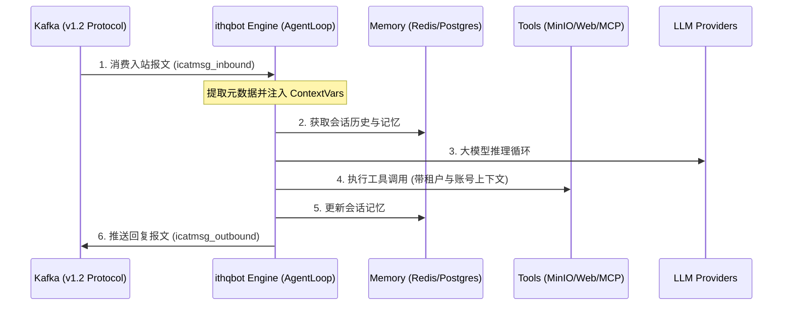

# ithqbot Engine 设计文档

本文档描述了 **ithqbot (Agent Engine)** 的核心设计架构。ithqbot 是一个独立、无状态的 AI 智能体引擎，通过 Kafka 与外部消息网关交互。

## 1. 总体架构

ithqbot 作为消费者接入消息总线，处理标准化的 AI 任务。

## 2. 核心组件

### 2.1 协议适配层 (Channel Adapter)
ithqbot 核心仅保留共享的 `icatmsg` 通道逻辑。它不关心消息是来自飞书还是 Web，只负责：
- 按照协议版本 (v1.2) 解析 Kafka 报文。
- 提取 `account_id`、`chat_id`、`tenant_id` 并将其注入全局 **ContextVars**。
- 处理完成后封装出站报文并写回 Kafka。

### 2.2 全局上下文 (Global Context)
为了避免在业务代码中层层传递身份和租户 ID，系统采用 Python `contextvars`：
- **自动关联**：底层工具（如 MinIO、数据库）直接通过 `ithqbot.context` 获取当前的 `tenant_id`，实现资源隔离。
- **安全性**：确保不同租户的对话历史和知识库在物理上完全隔离。

### 2.3 租户隔离策略 (Multi-tenancy)
- **复合主键**：用户身份判定依托于 `(tenant_id, account_id)`。
- **存储路径**：所有文件操作强制带上租户前缀，如 `/{tenant_id}/{account_id}/{chat_id}/...`。

### 2.4 可观测性 (Trace & Monitoring)
- **全链路追踪**：通过 `trace_id` 监控从进入 Engine 到返回 Kafka 的完整耗时。
- **状态流转**：Agent 在执行复杂 Skill 或工具时，会通过 Kafka 实时推送中间状态（Processing Status），以便前端展示加载进度。

## 3. 容错与并发

- **顺序保证**：依靠 Kafka 的分区机制（Partition by `account_id`），确保同一账号的消息在 Engine 端串行处理，维持上下文逻辑严密。
- **水平扩展**：同一个 `bot_id` 可以启动多个 Engine 实例，通过 Kafka Consumer Group 实现负载均衡。
- **无状态性**：Engine 进程不保留长连接状态，所有持久化信息（Session/Memory）均外置到 Redis 或数据库中。
