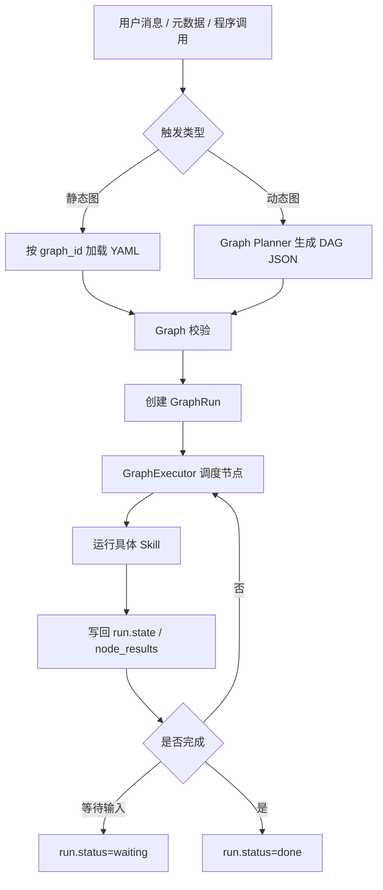
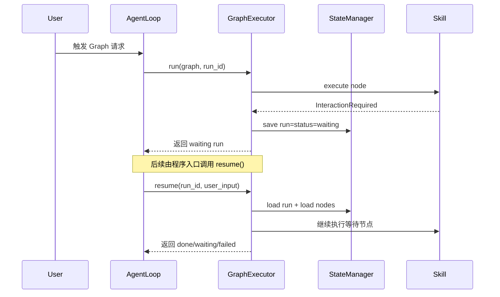

# Graph Skill 设计说明

本文档说明 ithqbot 中 Graph Skill 的构建方式、触发方式、执行链路与当前边界，目的是回答两个核心问题：

- 如何构建一个可执行的 Graph Skill
- 如何从聊天入口、元数据入口或程序入口触发 Graph Skill

## 1. 设计目标

Graph Skill 不是一个单独的新 Tool 类型，而是一种“多 Skill 编排执行机制”。

它解决的问题是：

- 将单轮复杂请求拆成多个已存在 Skill 的 DAG
- 支持顺序、条件分支、并行执行与汇聚
- 在执行过程中保留统一的状态、进度与可观测信息
- 在需要用户补充信息时进入等待态，并支持后续恢复

Graph Skill 的运行入口主要由 `AgentLoop` 提供，底层由以下组件协作完成：

- `ithqbot.graph.loader`：加载图定义
- `ithqbot.planner`：将自然语言规划为图
- `ithqbot.graph.executor.GraphExecutor`：执行图
- `ithqbot.graph.state_manager.StateManager`：持久化图运行状态

## 2. 两种构建方式

### 2.1 静态构建：手工编写 Graph 文件

适合以下场景：

- 流程稳定，节点和分支结构固定
- 需要复用、审计、灰度和版本化管理
- 希望用 `graph_id` 直接触发

图文件搜索目录如下：

- `<workspace>/graphs`
- `<workspace>/skills_graphs`
- `<workspace>/skills`
- 内置 `ithqbot/graphs`
- 内置 `ithqbot/skills`

按 `graph_id` 查找时，系统会按以下候选路径尝试加载：

- `<dir>/<graph_id>.yaml`
- `<dir>/<graph_id>.yml`
- `<dir>/<graph_id>/graph.yaml`
- `<dir>/<graph_id>/graph.yml`

一个最小可运行示例：

```yaml
graph_id: approval_flow
nodes:
  - id: step1
    skill: approval_check
  - id: step2
    skill: approve_action
    input_mapping:
      request_id: state.request_id
    output_mapping:
      branch_result: data.message
  - id: step3
    skill: result_summary
    input_mapping:
      result: state.branch_result
edges:
  - from: step1
    to: step2
    condition: state.approved == true
  - from: step2
    to: step3
```

字段说明：

- `graph_id`：图的唯一标识
- `nodes[].id`：节点唯一 ID
- `nodes[].skill`：必须是当前 Agent 已注册的 Skill/Tool 名称
- `nodes[].input`：节点固定输入
- `nodes[].input_mapping`：从全局状态映射到节点入参
- `nodes[].output_mapping`：从节点输出映射回全局状态
- `edges[].condition`：可选条件表达式

### 2.1.1 Composite Skill：把流程当作 Skill 暴露

当某个能力本质上是“多个已有 Skill 的稳定组合”时，推荐把它建模为 Composite Skill，而不是重复写一个大 Tool。

目录示例：

```text
skills/
└── weekly_report/
    ├── SKILL.md
    ├── graph.yaml
    └── schema.json
```

最小示例：

```yaml
graph_id: weekly_report
nodes:
  - id: fetch_tasks
    skill: task_query
  - id: analyze
    skill: task_analysis
  - id: generate
    skill: report_generate
edges:
  - from: fetch_tasks
    to: analyze
  - from: analyze
    to: generate
```

推荐配套元数据：

- `metadata.ithqbot.level: composite`
- `metadata.ithqbot.capability/tags`
- `metadata.ithqbot.planner.*`
- `schema.json` 中声明 `input_schema`、`output_schema` 与 `semantic`

这样做的意义是：

- 对外仍然是一个可被路由与规划的“高层能力”
- 对内保留可审计、可恢复、可并行的 DAG 执行能力
- Planner 可以把它当作一个抽象节点，而不是总是重新发明内部流程

### 2.2 动态构建：通过 Planner 由自然语言生成图

适合以下场景：

- 用户需求动态变化
- 很难提前把流程全部固化成 YAML
- 需要根据可用 Skill 自动拆解执行步骤

动态构建流程：

1. Agent 收到“请用技能图处理 xxx”之类请求
2. `AgentLoop.plan_graph()` 调用 `GraphPlanner`
3. Planner 基于可用 Skill 索引、few-shot 示例和 Prompt 生成 JSON DAG
4. 系统执行 DAG 校验
5. 通过 `load_graph_from_dict()` 转成运行时 Graph 对象
6. 交给 `GraphExecutor` 执行

Planner 输出的 JSON 结构与手工 YAML 的逻辑结构一致，只是来源不同。

本轮已补强的 Planner 依据：

- 读取 Skill 的 `input_schema` / `output_schema`
- 读取 `semantic.produces` / `semantic.consumes`
- 读取 `metadata.ithqbot.capability/tags/level`
- 读取 `metadata.ithqbot.planner.input_from/output_to/incompatible_with/preferred_after`
- 在重试时把上一轮校验失败原因回灌给 LLM，生成修复版 DAG

## 3. 触发方式

当前 Graph Skill 可以通过 4 类入口触发。

### 3.1 斜杠命令触发

适合调试、验证与显式调用。

支持命令：

- `/graph plan <request>`：规划并执行
- `/graph preview <request>`：只预览生成的图 JSON
- `/graph run <graph_id>`：执行静态图

示例：

```text
/graph plan 帮我分析告警并总结根因
/graph preview 根据审批结果选择执行路径并汇总结果
/graph run approval_flow
```

## 3.4 Graph Trace 约定

Graph Skill 的运行态事件统一落到 TraceEvent，便于在链路侧边栏和后续 DAG 视图中还原完整执行树。

当前标准约定如下：

- 图级事件：
  - `graph.run.start`
  - `graph.run.resume`
  - `graph.run.waiting`
  - `graph.run.done`
  - `graph.run.failed`
- 节点级事件：
  - `graph.node.start`
  - `graph.node.resume`
  - `graph.node.waiting`
  - `graph.node.done`
  - `graph.node.failed`
  - `graph.node.skipped`
- Planner 事件：
  - `graph.planner.started`
  - `graph.planner.failed`
  - `graph.planner.retry`
  - `graph.planner.completed`

为了让 Trace UI 能稳定合并开始态与结束态，并构建父子树，Graph/Planner 事件需要遵循以下字段约束：

- 图级事件在 `details` 中写入：
  - `graph_id`
  - `run_id`
  - `graph.*`
- 节点级事件在 `details` 中写入：
  - `graph_id`
  - `run_id = <graph_run_id>:<node_id>`
  - `node_id`
  - `parent_run_id = <graph_run_id>`
  - `graph.*`
  - `node.*`
- Planner 事件在 `details` 中写入：
  - `run_id = planner:<trace_id_or_request_msg_id>:<attempt>`
  - `planner_attempt`
  - `graph_id`（完成态可用时）

恢复执行时，Executor 会先补发 `graph.run.resume` 与对应 `graph.node.resume`，然后重新进入正常调度循环。

其中 `graph.topology` 与 `node.*` 推荐采用以下结构，供 Trace Observability 的 Tree / DAG 视图直接消费：

- `graph.topology.nodes`
  - `node_id`
  - `skill_name`
  - `status`
  - `title` / `label`（可选）
- `graph.topology.edges`
  - `from`
  - `to`
  - `condition`（可选）
  - `kind`，默认 `dependency`
- `graph` 聚合统计
  - `node_count`
  - `completed_nodes`
  - `failed_nodes`
  - `waiting_nodes`
  - `running_nodes`
  - `pending_nodes`
  - `skipped_nodes`
  - `current_node_ids`
- `node`
  - `node_id`
  - `skill_name`
  - `status`
  - `waiting_for_input`
  - `interaction`
  - `state_update_keys`
  - `input_mapping_keys`
  - `output_mapping_keys`
  - `error`

约束建议：
- 图级事件负责声明稳定拓扑，避免前端通过 `parent_run_id` 或事件时间顺序推断边关系。
- 节点级事件负责更新同一 `node_id` 的最新运行态，特别是 `waiting`、`failed`、`skipped` 这类 UI 需要高亮的状态。
- 若图处于人工交互暂停态，图级状态可仍为 `running`，具体阻塞节点通过 `node.waiting_for_input = true` 表达。

### 3.2 自然语言触发

适合让终端用户直接表达意图。

当前内置了两类识别：

- 规划执行意图，例如：`请用技能图处理这条工单`
- 通过 `graph_id` 直接执行意图，例如：`执行技能图 approval_flow`

此外还存在一个特化快捷路径：

- 如果用户是在请求“检查某个 skill 是否符合规范”，系统会优先直连生成单节点 `check_skill` 图，而不是走通用 Planner

### 3.3 元数据触发

适合集成外部系统、网关或上层编排器。

可用方式包括：

- `metadata.graph_request = {"mode": "plan"|"preview", "query": "..."}`
- `metadata.graph_request = {"mode": "run_by_id", "graph_id": "..."}`
- `metadata.execution_mode = "graph"|"graph_preview"|"graph_run"`
- 配合 `metadata.graph_query` 或 `metadata.graph_id`

如果需要在图启动前注入初始状态，可使用：

- `metadata.graph_initial_state`

示例：

```json
{
  "graph_request": {
    "mode": "run_by_id",
    "graph_id": "approval_flow"
  },
  "graph_initial_state": {
    "request_id": "REQ-1001"
  }
}
```

### 3.4 程序调用触发

适合测试代码、服务内部组合调用和后续 API 封装。

可直接调用：

- `AgentLoop.run_graph(graph, ...)`
- `AgentLoop.run_graph_by_id(graph_id, ...)`
- `AgentLoop.handle_request_via_graph(query, ...)`
- `AgentLoop.plan_graph(query)`

如果是 Composite Skill，程序侧也可以直接按 `graph_id` 调用，无需区分它来自 `graphs/` 目录还是 `skills/<skill_name>/graph.yaml`。

## 4. 执行模型

### 4.1 总体流程



### 4.2 节点输入输出规则

节点执行时，输入数据按以下优先级构建：

1. `run.state`
2. `node.input`
3. `node.input_mapping` 映射结果覆盖同名字段

节点返回后，状态写回规则如下：

- 若未声明 `output_mapping`，默认把 `result.data` 合并进全局 `run.state`
- 若声明了 `output_mapping`，仅把映射字段写回 `run.state`

因此推荐：

- 公共中间变量统一写入 `state`
- 终态结果写入 `final_answer`、`summary`、`result` 一类标准字段

为了支持自动编排，推荐每个参与 Graph 的 Skill 补齐以下契约：

- `input_schema`：声明节点入参结构
- `output_schema`：声明节点输出结构
- `semantic.produces`：声明它会产出哪些语义对象
- `semantic.consumes`：声明它依赖哪些语义对象

Planner 与 Validator 会利用这些信息判断两个节点是否应该相连。

### 4.3 条件与并行

图调度器具备以下行为：

- 若多个节点同时满足依赖条件，会并行执行
- 条件边使用 `condition` 判断是否激活
- 若某些节点因条件不满足不可达，会被标记为跳过
- 汇聚节点会等待其有效前置路径满足后再执行

本轮新增优化：

- 若并行分支中只有部分节点进入等待用户输入态，其它独立可运行分支仍会继续执行并持久化结果，不会被无条件整体取消
- Graph Validator 会在边校验阶段检查 Planner 约束与语义兼容性，提前拒绝明显错误的连边

### 4.4 等待态与恢复

当某个节点抛出 `InteractionRequired` 时：

- 节点状态变为 `waiting`
- 图运行状态变为 `waiting`
- 系统会上报交互事件与 `graph_waiting` 进度阶段

当前能力边界：

- 执行引擎层已经支持 `GraphExecutor.resume(run_id, user_input, ...)`
- 图运行状态已支持持久化恢复
- 但聊天入口层目前尚未提供统一的 `/graph resume <run_id>` 用户命令

这意味着：

- 引擎能力已经具备
- 若上层网关或业务服务需要恢复，可通过程序调用接入
- 面向最终用户的标准恢复指令仍可后续补充

恢复流程如下：



## 5. Graph 节点中的上下文约定

Graph 节点执行时，系统会自动把以下信息注入节点 `SkillContext`：

- `skill_name`：当前节点 Skill 名称
- `parent_run_id`：当前图运行 ID
- `metadata.graph.graph_id`
- `metadata.graph.run_id`
- `metadata.graph.node_id`

因此在 Graph 内实现 Skill 时，推荐直接读取：

```python
graph_meta = context.metadata.get("graph", {})
run_id = context.parent_run_id
graph_id = graph_meta.get("graph_id")
node_id = graph_meta.get("node_id")
```

并在进度上报中透传：

```python
await context.emit_progress(
    60,
    "processing",
    "图节点执行中",
    progress_stage="graph_node_running",
    call_type="graph",
    skill_name=context.skill_name,
    status_details={
        "graph": {
            "run_id": run_id,
            "graph_id": graph_id,
            "node_id": node_id,
        }
    },
)
```

## 6. 推荐的落地方式

### 6.1 什么时候优先使用静态图

- 核心业务流程固定
- 需要稳定复用与审计
- 流程上线前希望人工评审图结构

### 6.2 什么时候优先使用 Planner

- 用户问题变化大
- Skill 组合方式难以预先穷举
- 可以接受“先规划、再校验、再执行”的动态行为

### 6.3 推荐组合策略

推荐采用“静态图为主，Planner 为辅”：

- 高频、关键链路使用静态图
- 长尾复杂请求使用 Planner 动态生成
- 对确定性强的意图保留快捷图直连逻辑
- 对稳定多步骤能力优先沉淀为 Composite Skill，再由 Planner 把它作为高层节点复用

## 7. 当前限制与后续可优化点

当前已知限制：

- 聊天入口尚未暴露统一的 `/graph resume <run_id>` 命令
- Graph 状态存储当前以 PostgreSQL 持久化为主，Redis 不是图恢复的权威存储
- 成本/SLA 元数据已可声明和读取，但执行调度层尚未基于 `cost/latency/idempotent/retryable` 做优先级或重试策略分流

建议后续优化：

- 增加 `/graph resume <run_id>` 入口
- 基于 `cost/latency/idempotent/retryable` 做调度与重试策略
- 为 Graph 增加导出/调试视图，例如节点耗时、状态快照、输入输出摘要

## 8. 相关文档

- `SKILL_STANDARDS.md`：Graph/Planner 规范摘要
- `SESSION_STORE_GUIDE.md`：Graph 状态持久化约束
- `PENDING_FEATURES.md`：Graph 能力实现状态与里程碑
