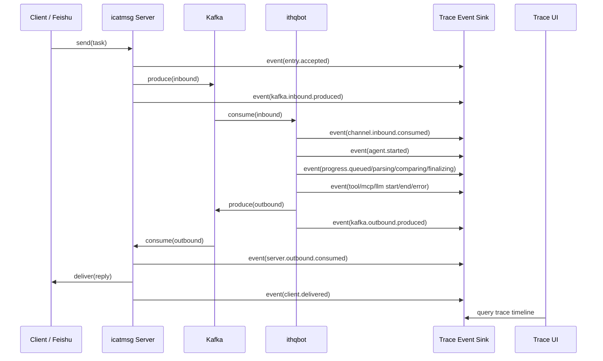

# ithqbot 用户级链路追踪与可视化方案

## 1. 文档定位
- 本文档独立描述“用户级任务链路追踪与可视化”方案。
- 一期采用 **方案 A：轻量自研链路时间线**，优先解决“某个用户发起一次任务后，系统内部到底经历了什么”的可观测问题。
- 后续演进采用 **方案 C：LangSmith 风格任务观测台**，逐步沉淀为产品级调试、复盘与运营能力。
- 本文档聚焦以下主链路：
  - `飞书 / icatmsg Client -> icatmsg Server -> Kafka -> ithqbot -> skill / tool / MCP / LLM -> Kafka -> icatmsg Server -> Client`

## 2. 背景与目标

### 2.1 背景
- 当前系统已经具备多渠道接入、Kafka 异步桥接、AgentLoop 处理、Tool / MCP 调用与消息回投能力。
- 但当用户反馈“没回复”“卡住了”“工具失败了”“消息投递错了”时，排障仍需要跨多个日志、多个组件手工拼接。
- 现有 `status.processing` 只能表达少量用户态进度，不能完整展示整条任务链路。
- 现有 Redis 审计与 LLM 统计更偏调用级采样，还缺少面向单次任务的统一视图。

### 2.2 总体目标
- 支持按 **用户 / 会话 / 机器人 / 单次请求** 追踪整条任务链路。
- 支持可视化查看一次任务在各阶段的状态、耗时、错误点与调用树。
- 支持区分问题发生在：
  - 客户端入口
  - icatmsg Server
  - Kafka 入站 / 出站
  - ithqbot Channel
  - AgentLoop
  - skill / tool / MCP / LLM
  - 客户端回投
- 在不明显增加主链路延迟的前提下，为后续产品化观测台提供统一数据底座。

### 2.3 非目标
- 一期不直接引入完整 OpenTelemetry 全栈体系。
- 一期不追求所有底层中间件指标纳入统一 span 模型。
- 一期不默认向终端用户展示全部 prompt、工具输入输出原文。

## 3. 方案选择

### 3.1 选型结论
- 一期选择 **方案 A：轻量自研链路时间线**
- 二期及后续演进选择 **方案 C：LangSmith 风格任务观测台**

### 3.2 选择理由
- 当前代码库已具备 `request_msg_id`、`trace_id`、`account_id`、`chat_id`、`client_id`、`bot_id` 等关键关联字段，适合快速落地统一任务时间线。
- 当前链路中已有 `status.processing`、Tool/MCP 审计与 LLM usage 记录，可作为初始事件源直接复用。
- 自研轻量方案对现有系统侵入更小，实施成本更可控，更适合先解决排障效率问题。
- 待统一事件模型稳定后，再做产品化 UI、复盘、重放与对比能力，风险更低。

## 4. 现有基础与可复用能力

### 4.1 已有关键链路节点
- 用户消息入口：`icatmsg/server/app.py` 的 `/send`
- Kafka 入站消费：`ithqbot/channels/icatmsg.py`
- Agent 主处理：`ithqbot/agent/loop.py`
- Tool 审计：`ithqbot/agent/tools/registry.py`
- MCP 审计：`ithqbot/agent/tools/mcp.py`
- 服务端出站与客户端投递：`icatmsg/server/app.py`

### 4.2 已有可复用关联字段
- 主关联键：
  - `request_msg_id`
- 辅助关联键：
  - `trace_id`
  - `header.msg_id`
  - `header.parent_msg_id`
- 用户 / 会话维度：
  - `tenant_id`
  - `account_id`
  - `chat_id`
  - `client_id`
  - `bot_id`
- 运行态维度：
  - `channel`
  - `content_type`
  - `status.phase`
  - `status.stage`
  - `status.progress_percent`
  - `call_type`
  - `name`

### 4.3 现有不足
- `trace_id` 还不是所有入口都强制生成。
- 目前缺少统一的“单次任务事件模型”。
- Tool / MCP / LLM 信息存在，但还没有稳定映射回一条用户任务时间线。
- 缺少前端可视化页面与查询接口。

## 5. 一期方案：轻量自研链路时间线

### 5.1 一期目标
- 让运维、研发、机器人维护者能够按用户或请求快速定位问题断点。
- 支持查看某次请求从入口到回包的完整时间线。
- 支持查看工具调用、MCP 调用、模型调用的阶段性信息。
- 支持查看失败点、重试点、投递状态。

### 5.2 一期用户
- 研发排障人员
- 机器人维护人员
- 平台运维人员
- 管理员

### 5.3 一期核心体验
- 输入 `account_id`、`request_msg_id`、`chat_id` 或时间范围即可检索一次任务。
- 打开详情后可看到：
  - 顶部任务摘要
  - 中间全链路时间线
  - 下方节点明细
  - 右侧错误与上下文摘要

### 5.4 一期总体架构



### 5.5 一期事件采集原则
- 所有事件都围绕 **一次用户任务** 展开。
- 每个关键阶段写入统一格式的 trace event。
- 业务链路只做轻量事件上报，不做重查询、重聚合。
- 事件写入采用异步方式，避免阻塞消息处理。

### 5.6 当前落地状态
- 已完成：
  - 基于 `request_msg_id` 的 TraceTask / TraceEvent 存储与查询能力
  - Redis 优先、内存兜底的 TraceEvent Sink
  - `icatmsg Server -> Kafka -> ithqbot -> Kafka -> icatmsg Server -> Client` 主链路关键埋点
  - `GET /trace/tasks` 与 `GET /trace/tasks/{request_msg_id}` 查询接口
  - Chat 页面右侧链路追踪侧边栏
  - `account_id` 过滤、时间线滚动、事件序号、一键复制诊断信息、侧边栏调宽与自动隐藏
- 部分完成：
  - Tool / MCP / skill / LLM 事件标准化已接入主时间线，但二期所需的调用树、差异对比、统计分析尚未完成
  - 任务详情摘要、时间线与事件明细已可查看，但尚未拆分为独立任务列表页 / 详情页
- 待完成：
  - 汇总统计接口 `GET /trace/summary`
  - LangSmith 风格调用树 / DAG 视图
  - 任务重放、差异对比、运营分析等产品化能力

## 6. 一期统一事件模型

### 6.1 TraceTask
- 表示一次用户发起的完整任务。

建议字段：
- `trace_id`
- `request_msg_id`
- `tenant_id`
- `account_id`
- `chat_id`
- `client_id`
- `channel`
- `bot_id`
- `user_input_summary`
- `status`
- `started_at`
- `ended_at`
- `duration_ms`
- `error_summary`

### 6.2 TraceEvent
- 表示任务中的一个阶段性节点。

建议字段：
- `event_id`
- `trace_id`
- `request_msg_id`
- `parent_event_id`
- `event_name`
- `event_type`
- `component`
- `channel`
- `tenant_id`
- `account_id`
- `chat_id`
- `client_id`
- `bot_id`
- `status`
- `started_at`
- `ended_at`
- `duration_ms`
- `input_summary`
- `output_summary`
- `error_summary`
- `metadata`

当前实现额外支持以下树构建与汇总维度：

- `parent_run_id`：父节点 ID，用于把 graph node 或 planner retry 事件挂到上级运行节点
- `graph_id`：Graph Skill 标识
- `run_id`：稳定运行 ID；同一开始/结束事件会复用同一个 ID
- `node_id`：Graph 节点 ID
- `planner_attempt`：Planner 第几次尝试
- `idempotent`
- `retryable`

### 6.3 event_type 建议枚举
- `entry`
- `kafka_produce`
- `kafka_consume`
- `agent`
- `progress`
- `skill`
- `tool`
- `mcp`
- `llm`
- `delivery`
- `client`
- `system`

### 6.4 event_name 建议清单
- `client.send.accepted`
- `server.kafka.inbound.produced`
- `channel.kafka.inbound.consumed`
- `agent.task.started`
- `agent.progress.queued`
- `agent.progress.parsing`
- `agent.progress.extracting`
- `agent.progress.comparing`
- `agent.progress.finalizing`
- `skill.started`
- `skill.completed`
- `skill.failed`
- `tool.started`
- `tool.completed`
- `tool.failed`
- `mcp.started`
- `mcp.completed`
- `mcp.failed`
- `llm.started`
- `llm.completed`
- `llm.failed`
- `server.kafka.outbound.produced`
- `server.kafka.outbound.consumed`
- `server.client.delivered`
- `client.message.received`

Graph / Planner 扩展事件：

- `graph.run.start`
- `graph.run.resume`
- `graph.run.waiting`
- `graph.run.done`
- `graph.run.failed`
- `graph.node.start`
- `graph.node.resume`
- `graph.node.waiting`
- `graph.node.done`
- `graph.node.failed`
- `graph.node.skipped`
- `graph.planner.started`
- `graph.planner.failed`
- `graph.planner.retry`
- `graph.planner.completed`

这些事件的命名目标是：

- 图级生命周期统一使用 `graph.run.*`
- 节点级生命周期统一使用 `graph.node.*`
- 开始态使用 `start`
- 成功结束态使用 `done`
- 需要用户补充信息时使用 `waiting`
- 从等待态继续执行时使用 `resume`

### 6.5 Trace Tree 与 Summary 聚合

Trace 存储层会从事件 `details` 中抽取以下维度，并同步写回 TraceTask 摘要：

- `graph_id`
- `run_id`
- `node_id`
- `planner_attempt`
- `idempotent`
- `retryable`

聚合接口除基础状态统计外，还可输出：

- `graph_tasks`
- `planner_retry_tasks`
- `idempotent_tasks`
- `retryable_tasks`
- `top_graphs`

Trace tree 构建规则：

- 优先使用事件或 `details` 中的 `run_id` 作为稳定节点 ID
- 使用 `parent_run_id` 连接父子节点
- 同一 `run_id` 的开始/结束事件会合并到一个树节点上，状态与耗时以后续事件为准

## 7. 一期存储与查询设计

### 7.1 存储建议
- 推荐优先采用 **Redis + 持久化存储双层方案**：
  - Redis：承接近期热数据与实时页面刷新
  - 持久化表：承接历史查询、排障回溯、统计分析

### 7.2 一期落地建议
- 若追求最快上线：
  - 先使用 Redis Stream / Redis List 保存 TraceEvent
  - 使用 Redis Hash 保存 TraceTask 摘要
- 若希望更容易做历史检索：
  - 增加 `trace_tasks` 与 `trace_events` 两张表

### 7.3 建议表结构

`trace_tasks`
- `trace_id`
- `request_msg_id`
- `tenant_id`
- `account_id`
- `chat_id`
- `client_id`
- `channel`
- `bot_id`
- `status`
- `user_input_summary`
- `error_summary`
- `started_at`
- `ended_at`
- `duration_ms`

`trace_events`
- `event_id`
- `trace_id`
- `request_msg_id`
- `parent_event_id`
- `event_name`
- `event_type`
- `component`
- `status`
- `tenant_id`
- `account_id`
- `chat_id`
- `client_id`
- `bot_id`
- `started_at`
- `ended_at`
- `duration_ms`
- `input_summary`
- `output_summary`
- `error_summary`
- `metadata_json`

### 7.4 索引建议
- `trace_tasks(request_msg_id)`
- `trace_tasks(account_id, started_at desc)`
- `trace_tasks(bot_id, started_at desc)`
- `trace_events(trace_id, started_at asc)`
- `trace_events(request_msg_id, started_at asc)`

## 8. 一期接口设计

### 8.1 查询任务列表
- `GET /trace/tasks`
- 查询参数建议：
  - `account_id`
  - `chat_id`
  - `client_id`
  - `bot_id`
  - `channel`
  - `status`
  - `start_at`
  - `end_at`
  - `keyword`
  - `limit`

### 8.2 查询单个任务详情
- `GET /trace/tasks/{request_msg_id}`
- 返回：
  - 任务摘要
  - 时间线事件列表
  - 节点耗时统计
  - 错误摘要

### 8.3 查询某个用户近期任务
- `GET /trace/users/{account_id}/tasks`

### 8.4 查询运行态健康与异常汇总
- `GET /trace/summary`
- 用于聚合：
  - 失败任务数
  - 超时任务数
  - 各组件平均耗时
  - Tool/MCP/LLM 错误排行

## 9. 一期前端页面设计

### 9.1 页面结构
- 当前已落地：Chat 页面右侧链路追踪侧边栏
- 后续可演进：
  - 页面 1：任务列表页
  - 页面 2：任务详情页

### 9.2 任务列表页
- 筛选项：
  - 时间范围
  - 用户
  - 机器人
  - 渠道
  - 状态
  - 关键词
  - `account_id`
- 列展示：
  - 请求摘要
  - 用户
  - 机器人
  - 当前状态
  - 总耗时
  - 起始时间
  - 错误摘要

### 9.3 任务详情页
- 顶部摘要卡片：
  - `request_msg_id`
  - `trace_id`
  - `account_id`
  - `chat_id`
  - `client_id`
  - `channel`
  - `bot_id`
  - `status`
  - `duration_ms`
- 中间主区域：
  - 时间线瀑布图
  - 关键阶段节点
- 下方区域：
  - 事件明细表
- 右侧区域：
  - 错误信息
  - 输入输出摘要
  - metadata
- 当前已落地能力：
  - 顶部请求摘要
  - 纵向时间线
  - 事件明细卡片
  - 一键复制当前追踪信息

### 9.4 一期可视化形态
- 纵向时间线
- 横向耗时条
- 节点状态颜色区分：
  - 成功：绿色
  - 处理中：蓝色
  - 失败：红色
  - 跳过 / 未执行：灰色

## 10. 一期埋点落点

### 10.1 icatmsg Server
- `/send` 接收到请求时记录 `client.send.accepted`
- 入站 Kafka 发送成功后记录 `server.kafka.inbound.produced`
- 出站 Kafka 消费到回复时记录 `server.kafka.outbound.consumed`
- 推送给客户端或飞书成功 / 失败时记录 `server.client.delivered`

### 10.2 icatmsg Channel
- 消费入站消息时记录 `channel.kafka.inbound.consumed`
- 出站消息准备投递 Kafka 时记录 `server.kafka.outbound.produced`
- 对 `status.processing` 事件统一补齐 `request_msg_id` / `trace_id`

### 10.3 AgentLoop
- 进入主任务处理时记录 `agent.task.started`
- 每个阶段记录 `agent.progress.*`
- 完成任务时记录 `agent.task.completed`
- 异常时记录 `agent.task.failed`

### 10.4 skill / tool / MCP / LLM
- 基于现有审计点补标准化 trace event
- 起始、完成、失败均记录独立节点
- 记录耗时、状态、错误摘要、输入输出摘要

## 11. 一期实施步骤

### 11.1 第一步：统一 trace 字段
- 已完成
- 在所有入口保证生成或继承 `trace_id`
- 确保 `request_msg_id` 在全链路稳定透传
- 明确 `trace_id` 与 `request_msg_id` 的职责：
  - `request_msg_id`：单次用户请求主键
  - `trace_id`：同一请求全链路追踪键

### 11.2 第二步：建立 TraceEvent Sink
- 已完成
- 提供统一写入接口
- 已对接 Redis，并提供内存兜底
- 支持非阻塞写入

### 11.3 第三步：在主链路补关键埋点
- 已完成
- Server
- Channel
- AgentLoop
- Tool / MCP / skill / LLM

### 11.4 第四步：提供查询 API
- 部分完成
- 已完成：
  - 列表查询
  - 详情查询
  - 用户维度查询
- 待完成：
  - 汇总统计查询

### 11.5 第五步：交付可视化页面
- 部分完成
- 已完成：
  - Chat 页面右侧链路追踪侧边栏
  - 时间线图
  - 调用树视图
  - Graph Skill DAG 视图
  - 节点详情卡片与时间线 / 树 / DAG 联动
- 待完成：
  - 独立列表页
  - 独立详情页
  - 更完整的节点详情面板
  - 图节点输入输出原文按权限展开

## 12. 产品化演进：LangSmith 风格任务观测台

### 12.1 演进目标
- 从“排障工具”升级为“任务观测平台”。
- 不仅看到链路是否成功，还能分析任务为什么成功或失败。
- 支持调试、复盘、对比、重放与运营分析。

### 12.2 产品化能力清单
- 任务列表筛选与检索
- 实时运行态跟踪
- 调用树 / DAG 视图
- Prompt / Tool / MCP 输入输出摘要查看
- 错误分类与归因
- 重试链路查看
- 任务重放
- 两次任务差异对比
- 按用户 / 机器人 / 渠道 / 工具进行统计

### 12.3 页面信息架构
- 工作台首页
- 任务列表页
- 任务详情页
- 节点详情抽屉
- 错误中心
- 统计分析页

### 12.4 详情页增强能力
- Timeline 视图
- Tree / Graph 视图
- Payload 视图
- Metrics 视图
- Retry / Dead Letter 视图

### 12.5 产品化指标建议
- 总任务数
- 成功率
- 平均耗时
- P95 耗时
- 平均 Tool 调用次数
- MCP 失败率
- LLM 错误率
- 客户端投递失败率
- Kafka 重试次数

## 13. 权限与安全

### 13.1 权限分层
- 普通终端用户：不开放完整链路观测页
- 管理员：可查看本租户链路
- 平台研发 / 运维：可查看跨组件明细

### 13.2 数据脱敏
- prompt、文件内容、工具原始输入输出默认只展示摘要
- 仅管理员或研发角色可展开敏感原文
- 错误栈需要脱敏处理，避免泄漏密钥、token、文件路径

### 13.3 数据保留策略
- 热数据短期保留
- 历史任务按租户或时间归档
- 支持按合规要求做删除与清理

## 14. 风险与应对

### 14.1 风险
- 埋点过多导致主链路变慢
- trace 字段未统一导致数据串不起来
- Tool/MCP 输入输出过大导致存储膨胀
- 敏感信息暴露风险

### 14.2 应对
- 采用异步写入
- 统一字段规范并加回归测试
- 原文只保留摘要，详细内容按需采样
- 为敏感字段做脱敏与权限控制

## 15. 分期建议

### 15.1 Phase 1
- 打通 trace_id / request_msg_id
- 建立 TraceEvent Sink
- 接入主链路关键节点
- 提供查询 API
- 交付任务列表页 + 任务详情页

### 15.2 Phase 2
- 增加调用树视图
- 增加实时刷新
- 增加错误统计与组件耗时分析
- 增加 retry / dead-letter 可视化

### 15.3 Phase 3
- 增加任务重放
- 增加任务对比
- 增加多维报表与运营指标
- 形成正式的任务观测平台

## 17. 附录：Phase 2/3 关键技术细节

### 17.1 异步事件流水线 (Async Pipeline)
为避免观测系统影响主链路性能，`ObservabilityStore` 引入了异步处理模式：
- **消息队列**：采样 `asyncio.Queue` 缓冲事件。
- **后台协程**：独立 Worker 周期性或按批次将数据同步至存储。
- **故障隔离**：当存储连接异常时，支持降级为内存存储。

### 17.2 租户级数据隔离 (Multi-Tenancy)
- **Key 前缀**：所有 Redis Key 均注入 `tenant_id`。
- **命名规范**：`ithqbot:trace:tenant:{tenant_id}:index:recent`。
- **管理员视图**：保留 `ithqbot:trace:index:recent` 全局索引用于跨租户检索。

### 17.3 存储分层 (Tiered Storage)
- **Redis (Hot)**：保留 24 小时内的热点数据。
- **PostgreSQL (Cold)**：
  - 表结构：`runs`, `events`, `feedbacks`。
  - 索引：按 `trace_id` 和 `tenant_id` 优化查询。
- **Janitor 服务**：
  - 每小时扫描 Redis 中已结束或超过 24 小时的数据。
  - 批量导出至 PG 并从 Redis 中移除。
  - 定期清理 PG 中超过 3 天的数据（配置项：`pg_retention_days`）。

### 17.4 配置项说明 (ObservabilityConfig)
在 `ithqbot/config/schema.py` 中新增：
```yaml
observability:
  async_mode: true       # 是否开启异步上报
  queue_size: 1000       # 异步队列长度
  flush_interval: 5      # 强制刷新间隔(秒)
  pg_uri: "postgresql://..." # 冷存储连接串
  retention_hours: 24    # Redis 保留时间
  pg_retention_days: 3   # PG 保留天数
```

### 17.5 树形结构查询 (Tree API)
通过 `GET /trace/tasks/{request_msg_id}/tree` 返回层级结构：
```json
{
  "request_msg_id": "...",
  "tree": [
    {
      "id": "run_1",
      "name": "agent.task",
      "children": [
        { "id": "run_1_1", "name": "tool.call" }
      ]
    }
  ]
}
```

### 17.6 DAG 结构查询 (Graph API)
通过 `GET /trace/tasks/{request_msg_id}/graph` 返回 Graph Skill 的拓扑与运行态快照：

```json
{
  "request_msg_id": "req_graph",
  "graph_id": "approval_flow",
  "run_id": "graph-run-1",
  "status": "waiting",
  "summary": {
    "node_count": 3,
    "completed_nodes": 1,
    "failed_nodes": 0,
    "waiting_nodes": 1,
    "running_nodes": 0,
    "pending_nodes": 1,
    "skipped_nodes": 0,
    "current_node_ids": ["approve"]
  },
  "nodes": [
    {
      "node_id": "draft",
      "run_id": "graph-run-1:draft",
      "parent_run_id": "graph-run-1",
      "skill_name": "writer",
      "status": "done",
      "started_at": 1710000000000,
      "finished_at": 1710000000120,
      "duration_ms": 120,
      "error": null,
      "waiting_for_input": false,
      "interaction": null,
      "state_update_keys": ["draft_text"],
      "input_mapping_keys": [],
      "output_mapping_keys": ["draft_text"],
      "latest_event_name": "graph.node.done"
    }
  ],
  "edges": [
    {
      "from": "draft",
      "to": "approve",
      "condition": null,
      "kind": "dependency"
    }
  ]
}
```

字段约束：
- `summary` 先吸收图级事件里的聚合值，再用节点最新状态做纠偏，确保统计值与当前 DAG 节点状态一致。
- `nodes` 以 `node_id` 去重，按拓扑顺序输出，避免前端使用启发式猜测。
- `edges` 直接来自 `graph.topology.edges` 或节点级事件中的补充信息，至少包含 `from` 与 `to`。
- `status` 表示当前图级状态；单个节点是否等待人工输入由 `waiting_for_input` 与 `interaction` 表达。
